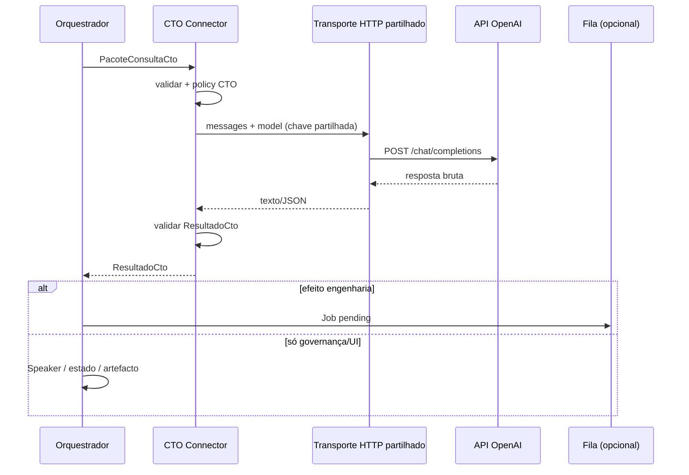

# ARQ-015 — CTO Connector (Conector CTO)

> **Status: Homologada v0.2** (01/08/2026).  
> Tipo ARQ (ADR-010). **Identificação:** ARQ-015.  
> **Capacidade:** CAP-11 — Integrações (vínculo com papel CTO / CON-001 Art. 6º II).  
> Norma superior: CON-001 Art. 6º–7º; ADR-002 D5; ADR-015; ADR-019; CAP-11; CNC-005 (agente conectado).  
> **Finalidade:** arquitetura do **CTO Connector** — canal estruturado entre o Orquestrador do CEO e o CTO (ChatGPT via API).  
> **Gate:** Homologada (patrocinador). Próximo artefacto: **REQ-054**.  
> **Decisão de infraestrutura:** Opção **B** — mesma chave OpenAI do backend; isolamento **lógico** (rotas, contratos, schemas, políticas, contexto, responsabilidades).

---

## 0. Quadro canónico (ADR-002)

| Pergunta | Resposta |
|----------|----------|
| **O que é?** | Componente de integração que recebe **contexto executivo** do Orquestrador, envia **consulta estruturada** ao CTO (ChatGPT via API), recebe **resposta estruturada** e devolve o resultado ao Orquestrador. |
| **Por que existe?** | Hoje o CTO só existe como papel constitucional no chat humano. Falta um canal técnico que preserve papéis (CTO não implementa; Engenheiro não decide arquitetura sozinho) e elimine a ponte manual de copiar/colar pareceres. |
| **Para quem existe?** | Patrocinador (menos atrito); Orquestrador/CEO Digital (consulta governada); CTO (canal formal); Engenheiro (recebe despachos já filtrados). |
| **Como medir sucesso?** | (1) Consulta CTO sem colar contexto à mão; (2) resposta validável por schema; (3) Orquestrador retoma o fluxo com o resultado; (4) canais MRE e CTO **separados logicamente** (mesmo que partilhem a mesma chave de API). |

---

## 1. Posicionamento arquitetural

### 1.1 O que o Connector **não** é

| Não é | Porquê |
|-------|--------|
| O LLM do Agente Executivo (`adaptadorLlmCeo` / MRE) | Esse canal delibera *como CEO Digital*; o CTO é papel distinto (CON-001). |
| O Orquestrador MRE (`pipeline/orquestrador.js`) | O MRE delibera; o Connector **transporta** consultas de governança/arquitetura. |
| O Dispatcher Cursor (REQ-053) | Esse acorda o Engenheiro; o Connector consulta o CTO. |
| Substituição do chat ChatGPT do patrocinador | MVP pode coexistir; o Connector é o canal *do sistema*, não o substituto total da conversa humana com o CTO. |
| Um segundo cofre de credenciais | Opção B: **não** exige `CEO_CTO_API_KEY` distinta. |

### 1.2 Onde se encaixa

```text
                    ┌─────────────────────────────────────┐
                    │     Orquestrador (Núcleo Executivo)   │
                    │  executiveEngine — ponto de coordenação │
                    └───────────────┬─────────────────────┘
                                    │
              ┌─────────────────────┼─────────────────────┐
              │                     │                     │
              ▼                     ▼                     ▼
        MRE / Speaker         Fila → Cursor          CTO Connector
     (deliberação CEO)      (REQ-045/053)         (esta ARQ — proposto)
              │                     │                     │
              ▼                     ▼                     ▼
        Parecer + prosa      Engenheiro (Agent)     CTO (ChatGPT API)
                                    │
                    ┌───────────────┴───────────────┐
                    │  Backend CEO — 1× infra HTTP   │
                    │  chave partilhada (Opção B)    │
                    │  → api.openai.com (ou BASE_URL)│
                    └───────────────────────────────┘
```

**Invariante:** o conhecimento e a decisão de *quando* consultar o CTO pertencem ao CEO/Orquestrador; o Connector é **meio**, substituível (ADR-002 D5 / CAP-11).

### 1.3 Nome do “Orquestrador” nesta ARQ

Salvo indicação em contrário, **Orquestrador** = **Núcleo Executivo** (`executiveEngine`) — coordenação de intenções e efeitos.  
Não confundir com: orquestrador MRE (estágios 0–7) nem orquestrador de voz (UX).

---

## 1A. Decisão de infraestrutura (homologada para esta ARQ)

### 1A.1 Opção B — credencial

| Decisão | Conteúdo |
|---------|----------|
| **Adotada** | **Opção B** |
| **Chave** | Reutilizar a **mesma** credencial já usada pelo backend do CEO: `CEO_LLM_API_KEY` **ou** `OPENAI_API_KEY` **ou** `CEO_OPENAI_API_KEY` (resolução já existente em `configDeEnv` / serviço LLM). |
| **Não adotar** | Namespace obrigatório `CEO_CTO_*` / segunda chave só para isolamento de papel. |

### 1A.2 Isolamento MRE ↔ CTO (obrigatório)

O isolamento **não** é por chaves distintas. É por:

| Dimensão | Como se separa |
|----------|----------------|
| **Rotas** | MRE: `/api/ceo/deliberar` (e afins). CTO: `/api/ceo/cto/...` (ou equivalente dedicado). |
| **Contratos** | IFA-CTO-01/02 vs mensagens livres do deliberar MRE. |
| **Schemas** | Catálogo `cto.*_v1` vs saída de estágio MRE / parecer executivo. |
| **Políticas** | System/developer policy do **papel CTO** (CON-001 Art. 6º II) ≠ prompt de governança do CEO Digital. |
| **Contexto** | Pacote de consulta CTO (mínimo + refs) ≠ `montarEntradaMre` / pipeline 0–7. |
| **Responsabilidades** | Connector transporta e valida; MRE delibera como CEO; Orquestrador decide *quando* chamar cada um. |

### 1A.3 Reutilização da infra HTTP existente

| Aspeto | Decisão |
|--------|---------|
| Transporte | **HTTP directo** do servidor CEO → API estilo OpenAI (`/chat/completions`), como hoje. |
| Código | **Reutilizar** o cliente/configuração HTTP existente (`chamarLlm` / `configDeEnv` / serviço em `server/src/services/llm.js` e paridade no plugin Vite) **sempre que possível**, evitando duplicar `fetch`, parsing de erros TLS, leitura de env. |
| Extensão | O Connector acrescenta **camada de domínio** (validação de pacote, policy CTO, schema de resposta) **em cima** do transporte partilhado — não um segundo stack HTTP paralelo. |
| Browser | Continua **sem** chave; só APIs internas do CEO. |

### 1A.4 O que já existe vs o que virá após Gate

| Peça | Estado |
|------|--------|
| Env + HTTP OpenAI no backend | **Existe** (canal MRE) |
| Resolução de chave partilhada | **Existe** |
| Rota/contratos/policy/schemas CTO + wiring Orquestrador | **A criar** após homologação final → REQ → IMP |

---

## 2. Responsabilidades

### 2.1 CTO Connector (compete)

| # | Responsabilidade |
|---|------------------|
| R1 | Aceitar um **Pacote de Consulta CTO** emitido pelo Orquestrador (contexto + pergunta + metadados). |
| R2 | Montar o pedido à API ChatGPT **sem** expor chaves ao browser; usar a **credencial partilhada** do backend (Opção B). |
| R3 | Aplicar **system/developer policy** do papel CTO (não implementar código; requisitos/arquitetura/revisão). |
| R4 | Exigir e validar **resposta estruturada** (schema) antes de devolver. |
| R5 | Devolver **Resultado CTO** ao Orquestrador (sucesso, recusa, ou erro tipado). |
| R6 | Registar rastreio mínimo (id da consulta, timestamps, modelo, tokens se disponíveis) — **sem** vazar segredos. |
| R7 | Invocar o **transporte HTTP partilhado** (não reimplementar cliente OpenAI do zero). |

### 2.2 CTO Connector (não compete)

| # | Fora de escopo do Connector |
|---|-----------------------------|
| N1 | Decidir *se* o CTO deve ser consultado (Orquestrador / política de gates). |
| N2 | Deliberar como CEO Digital (MRE). |
| N3 | Implementar código ou abrir PRs (papel Engenheiro / Fila). |
| N4 | Homologar requisitos ou ADRs (patrocinador / fluxo ADR-006). |
| N5 | Substituir a Fila de Execução ou o Dispatcher. |
| N6 | UI conversacional com o utilizador (Speaker / CN / canais). |
| N7 | Gerir uma segunda API key só para “parecer CTO”. |

### 2.3 Papéis adjacentes

| Ator | Papel face ao Connector |
|------|-------------------------|
| **Orquestrador** | Emite consulta; consome resultado; continua o fluxo (ex.: redigir REQ, pedir ADR, despachar Job). |
| **CTO (API)** | Responde no papel constitucional; saída estruturada. |
| **Patrocinador** | Homologa gates quando a política exigir humano. |
| **Engenheiro** | Só age se o Orquestrador (após CTO) despachar Job — via REQ-045/053. |

---

## 3. Interfaces (contratos lógicos)

> Contratos **lógicos** nesta ARQ. Schemas JSON formais e REQ derivados ficam para a etapa pós-homologação.

### 3.1 IFA-CTO-01 — Entrada: `PacoteConsultaCto`

| Campo | Obrig. | Descrição |
|-------|--------|-----------|
| `consultaId` | sim | UUID/ULID gerado pelo Orquestrador |
| `tipo` | sim | Enum: `parecer_arquitetural` \| `revisao_req` \| `revisao_arq` \| `gate` \| `duvida_normativa` \| `outro` |
| `pergunta` | sim | Questão objetiva ao CTO |
| `contextoExecutivo` | sim | Ver §3.2 |
| `artefactosRef` | não | Paths/IDs (REQ-xxx, ARQ-xxx, commits) — refs, não blobs gigantes |
| `restricoes` | não | Ex.: “não propor código”; “opções A/B/C” |
| `expectativaSchema` | sim | Identificador do schema de resposta esperado |
| `prioridade` | não | `normal` \| `alta` |
| `coaId` / `projeto` | não | Ancoragem COA (ex. MG2) |

### 3.2 Contexto executivo (mínimo)

| Bloco | Conteúdo típico |
|-------|-----------------|
| **Situação** | Objetivo atual, frente ativa, decisão pendente |
| **Norma aplicável** | Refs CON/ADR/REQ (não colar Constituição inteira por defeito) |
| **Estado** | Trecho da Âncora Mestra / checkpoint relevante |
| **Evidência** | Resumo factual (commits, Jobs, VAL) |
| **Pedido de formato** | O que o Orquestrador precisa para avançar (homologar / escolher opção / redigir enunciado) |

**Princípio:** contexto **suficiente e mínimo** (CON-001 — tempo do utilizador); o Connector pode aplicar *budget* de tokens.  
**Isolamento:** este pacote **não** é o payload do MRE; montagem e policy são próprias do canal CTO.

### 3.3 IFA-CTO-02 — Saída: `ResultadoCto`

| Campo | Obrig. | Descrição |
|-------|--------|-----------|
| `consultaId` | sim | Eco da entrada |
| `estado` | sim | `ok` \| `recusa` \| `erro_transporte` \| `erro_schema` \| `timeout` |
| `papelConfirmado` | sim | Deve ser `CTO` (validação anti-confusão de papéis) |
| `resumo` | se ok | Síntese curta para o Orquestrador / Speaker |
| `corpoEstruturado` | se ok | Objeto conforme `expectativaSchema` |
| `opcoes` | não | Lista A/B/C com prós/contras quando pedido |
| `recomendacao` | não | Opção preferida + justificação |
| `riscos` | não | Riscos explícitos |
| `proximosPassosSugeridos` | não | Para o Orquestrador (não ordens ao Engenheiro) |
| `rastreio` | sim | `modelo`, `latenciaMs`, `criadoEm` |

### 3.4 Schemas de `corpoEstruturado` (catálogo inicial)

| Schema ID | Uso |
|-----------|-----|
| `cto.parecer_v1` | Parecer com conclusão, alternativas, riscos, condições |
| `cto.revisao_artefacto_v1` | Aprovado / aprovado-com-OE / rejeitado + lista de OE |
| `cto.gate_v1` | Go / No-Go / Condicionado + checklist |
| `cto.duvida_normativa_v1` | Interpretação + refs normativas |

Novos schemas só por extensão documentada (REQ/ARQ posteriores).

### 3.5 IFA-CTO-03 — Porta de transporte (servidor)

| Aspeto | Proposta |
|--------|----------|
| Direção | Orquestrador (cliente interno) → **rota CTO no servidor** → transporte HTTP **partilhado** → API ChatGPT |
| Exposição browser | Apenas via API própria do CEO (ex. `/api/ceo/cto/...`); **nunca** chave no front |
| Credencial | **A mesma** do backend MRE (Opção B) |
| Precedente técnico | Extrair/reusar `configDeEnv` + `chamarLlm` (Vite plugin e/ou `server/src/services/llm.js`); camada CTO só acrescenta validação + policy + schema |
| Proibido | Duplicar um segundo cliente HTTP OpenAI “só CTO” sem necessidade |

---

## 4. Fluxo de comunicação

### 4.1 Sequência feliz

```text
1. Orquestrador determina necessidade de consultar CTO
2. Orquestrador monta PacoteConsultaCto (+ contexto executivo mínimo)
3. Orquestrador → CTO Connector (IFA-CTO-01)  [rota distinta de /deliberar]
4. Connector valida pacote; aplica policy de papel CTO
5. Connector → transporte HTTP partilhado → API ChatGPT
6. Connector valida ResultadoCto (IFA-CTO-02 + schema)
7. Connector → Orquestrador (resultado)
8. Orquestrador decide efeito:
      - comunicar ao utilizador (Speaker/CN), e/ou
      - atualizar estado/âncora, e/ou
      - abrir artefacto (REQ/ARQ), e/ou
      - despachar Job (Fila) se a decisão exigir Engenheiro
```

### 4.2 Sequência de falha

```text
erro_transporte / timeout  → Orquestrador: retry controlado ou degradar (“CTO indisponível”)
erro_schema                → Connector: 1 retry com prompt de correção; senão recusa tipada
recusa (CTO)               → Orquestrador: apresentar motivos; não inventar parecer
chave ausente no backend   → mesmo diagnóstico do canal MRE (LLM não configurado) — tipado no ResultadoCto
```

### 4.3 Diagrama lógico



---

## 5. Pontos de integração

| # | Ponto | Integração proposta | Notas |
|---|-------|---------------------|-------|
| P1 | **Núcleo Executivo** | Nova capacidade ou rota `consultar_cto` / gate explícito | Não misturar com capacidade `ia` deliberativa MRE |
| P2 | **Servidor app** | Rota dedicada CTO + **reuse** do serviço LLM HTTP | Mesma chave; rota ≠ `/deliberar` |
| P3 | **Contexto** | Montagem própria do pacote CTO (pode *ler* COA/âncora; não reutilizar cegamente o prompt MRE) | Isolamento por contexto |
| P4 | **Speaker / CN** | Orquestrador traduz `resumo` para o utilizador | Connector não fala com o utilizador |
| P5 | **Fila REQ-045/053** | Após parecer CTO, se houver trabalho técnico | Connector **não** publica Jobs |
| P6 | **Memória / learning** | Opcional: registo da consulta | Gate humano para promover a permanente |
| P7 | **Distribuição de governança (REQ-001)** | Pacote normativo alimenta o *policy* do Connector | CTO como agente conectado (CNC-005) |

### 5.1 Credenciais e canais (Opção B)

| Canal | Uso | Credencial | Isolamento |
|-------|-----|------------|------------|
| LLM MRE / CEO Digital | Deliberação executiva | `CEO_LLM_API_KEY` / `OPENAI_API_KEY` / `CEO_OPENAI_API_KEY` | Rota `/deliberar`, prompts MRE, parecer executivo |
| **CTO Connector** | Papel CTO | **A mesma** | Rota `/cto/...`, IFA-CTO-*, schemas `cto.*`, policy CTO |

Modelo (`CEO_LLM_MODEL` ou override por canal no REQ futuro) pode ser igual ou distinto **por configuração**, sem exigir segunda chave.

---

## 6. Riscos e mitigação

| Risco | Mitigação |
|-------|-----------|
| Confundir CTO com CEO Digital | Rotas, contratos, schemas, policies, contexto e responsabilidades separados; `papelConfirmado` |
| “Uma chave = um papel” (falso) | Documentar Opção B; testes de regressão que `/deliberar` ≠ `/cto` |
| Vazamento de Constituição/segredos na API | Budget de contexto; allowlist de artefactos; sem `.env` no prompt |
| CTO “implementar” via API | Policy + schema sem campos de patch/código; recusa |
| Duplicação de cliente HTTP | Mandato explícito de reutilizar transporte existente |
| Atraso / custo de API | Consultas só em gates; cache (fase posterior) |
| Bypass do fluxo ADR-006 | Connector não homologa — só aconselha |

---

## 7. Fora de escopo desta proposta

* Implementação e IMP.
* REQ numerado definitivo (sugerido pós-homologação: **REQ-054** ou seguinte livre).
* Segunda API key obrigatória para o CTO.
* V3 cloud 24/7 do Dispatcher (backlog — Âncora Mestra).
* Substituição total do ChatGPT UI do patrocinador.
* Multi-CTO / multi-fornecedor além do contrato OpenAI-compatible no MVP.

---

## 8. Critérios de homologação final desta ARQ

A ARQ-015 v0.2 considera-se homologável quando o patrocinador confirmar:

1. **Opção B** aceite (mesma chave; isolamento lógico).  
2. Separação Connector CTO ↔ LLM MRE nas seis dimensões (§1A.2).  
3. Reutilização do transporte HTTP existente aceite.  
4. Contratos IFA-CTO-01/02/03 suficientes para redigir REQ.  
5. Fluxo Orquestrador → Connector → transporte → API → Orquestrador aceite.  
6. Pontos P1–P7 aceites ou emendados.  
7. Autorização explícita para abrir **REQ** (e só então IMP) — **após** este Gate.

---

## 9. Rastreabilidade

| Elo | Referência |
|-----|------------|
| Capacidade | CAP-11 |
| Constituição | CON-001 Art. 6º II (CTO), Art. 7º §2 (independência de ferramenta) |
| ADRs | ADR-002 D5; ADR-015; ADR-019 |
| Precedentes CAP-11 | REQ-045; REQ-053 |
| Infra existente | `ceoLlmPlugin` / `server` LLM (`configDeEnv`, `chamarLlm`) |
| Conceito | CNC-005 — Agente Conectado |
| Implementação | *— condicionada a REQ-054 + IMP* |
| Âncora | `docs/learning/ANCORA-MESTRA.md` |
| Requisitos | **REQ-054** (em análise) |

---

## 10. Histórico

| Versão | Data | Quem | O quê | Resultado |
|--------|------|------|-------|-----------|
| 0.1 | 01/08/2026 | Engenheiro (Cursor) | Proposta inicial | Aguardava homologação |
| 0.2 | 01/08/2026 | Engenheiro + decisão patrocinador | Opção B; isolamento lógico; reuse HTTP | Homologada v0.2 (Gate arquitetural) |

---

*Fim da ARQ-015 v0.2 homologada. Implementação condicionada a REQ-054 + IMP.*
