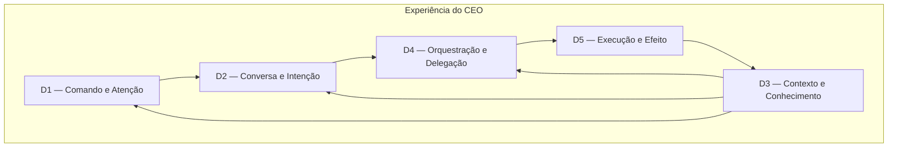
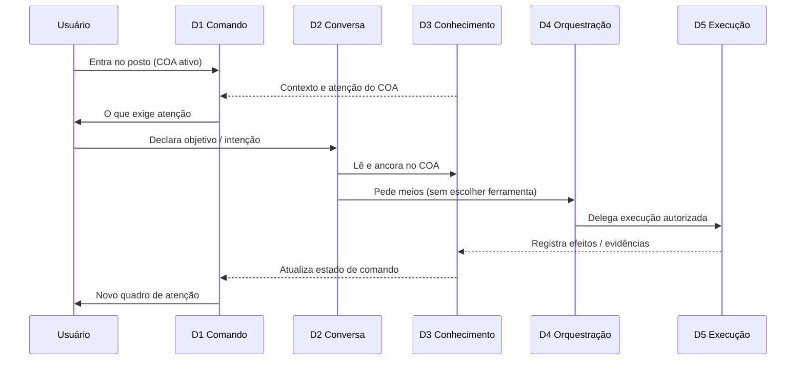

# F2-01 — Arquitetura Conceitual da Experiência do CEO

> **Status: Homologada — Gate F2-01 APROVADO (CTO, 26/07/2026).**  
> O Modelo de Domínios (D1–D5) e o COA como lente transversal integram oficialmente a arquitetura conceitual do produto.  
> Fase: **F2** — primeira capacidade concluída. Próxima: F2-02 (Modelo de Interações).  
> Natureza: **documento conceitual** — independente de tecnologia; sem decisões de implementação.  
> Norma: CON-001; VIS-007; P1–P6; DA-001…DA-003; IPR-001.  
> **Proibições:** sem alteração de REQ/ARQ técnica; sem código; sem telas; sem componentes; sem commit.

---

## As quatro perguntas (ADR-002)

| Pergunta | Resposta |
|----------|----------|
| **O que é?** | O modelo conceitual que organiza a experiência do produto CEO em grandes domínios, suas responsabilidades, o fluxo entre eles e os limites entre interface, orquestração, conhecimento e execução. |
| **Por que existe?** | Sem um mapa conceitual compartilhado, fundações visuais (F2+), UX (F3) e UI (F4) arriscam decidir forma antes de função — ou misturar camadas que o benchmark mostrou serem distintas (chat ≠ conhecimento; agente ≠ decisão; suite ≠ COA). |
| **Para quem existe?** | CTO (revisão e homologação); Engenheiro (referência obrigatória nas fases seguintes); Usuário (transparência do modelo de produto). |
| **Como o sucesso será medido?** | Quando toda especificação subsequente (visual, UX, UI, REQs futuros de experiência) situar-se em um domínio deste modelo, respeitar seus limites e citar as DA pertinentes — sem inventar uma segunda arquitetura de experiência. |

---

## 1. Objetivo da arquitetura conceitual

Estabelecer um **mapa mental único** da experiência do CEO, de modo que:

1. O produto seja pensado como **posto de comando executivo** (Human + IA sob governança), não como suite de apps, chat genérico ou dashboard de métricas.  
2. Cada grande domínio tenha **uma responsabilidade clara** e fronteiras explícitas com os demais.  
3. As diretrizes **DA-001, DA-002 e DA-003** tenham lugar estrutural no modelo — não apenas como texto normativo à parte.  
4. As próximas fases (fundações visuais, UX, UI, branding, ADRs de lacunas internas) saibam **o que especificar** e **o que não misturar**.  
5. Tecnologia, provedores de IA e detalhes de implementação permaneçam **fora** deste documento (ADR-010: agentes/ferramentas são substituíveis).

Este artefato **não** substitui VIS-007, REQ-037/039/041 nem ADRs técnicas. Ele **organiza a experiência** sobre essa fundação.

---

## 2. Grandes domínios da experiência

O modelo reconhece **cinco domínios conceituais**. Não são telas, microserviços nem pastas de código — são **espaços de responsabilidade** da experiência.

| ID | Domínio | Nome curto | Pergunta que responde |
|----|---------|------------|------------------------|
| **D1** | Comando e Atenção | *Posto de comando* | O que exige atenção do executivo **agora**, neste COA? |
| **D2** | Conversa e Intenção | *Interface principal* | O que o usuário quer alcançar / decidir? |
| **D3** | Contexto e Conhecimento | *Patrimônio vivo* | Sobre o que estamos trabalhando e o que já sabemos? |
| **D4** | Orquestração e Delegação | *Meios invisíveis* | Quem (humano/agente/IA) faz o quê — **sem** o usuário escolher a ferramenta? |
| **D5** | Execução e Efeito | *Ação e consequência* | O que foi feito e o que mudou no mundo / na organização? |

**Âncora transversal:** o **COA (Contexto Operacional Ativo)** não é um sexto domínio paralelo — é a **lente** que recorta D1–D5. Sempre existe exatamente um COA ativo; trocar o COA troca o recorte de todos os domínios (VIS-007 / REQ-037).

---

## 3. Responsabilidades de cada domínio

### D1 — Comando e Atenção

| Compete a D1 | Não compete a D1 |
|--------------|------------------|
| Apresentar o estado executivo do COA ativo (foco, urgências, próximo passo) | Listar todas as informações disponíveis |
| Priorizar o que exige atenção (alinha a P2; considera HP-004 em observação) | Substituir a conversa como centro (VIS-007) |
| Permitir leitura em diferentes níveis de abstração (DA-003) | Escolher modelos de IA ou ferramentas |
| Transmitir controle e soberania do usuário (P1) | Executar trabalho autônomo opaco |

### D2 — Conversa e Intenção

| Compete a D2 | Não compete a D2 |
|--------------|------------------|
| Ser a **interface principal** de interação (VIS-007 / REQ-041) | Ser chat genérico sem COA (antimodelo RC-03) |
| Capturar objetivo e intenção do usuário (DA-001) | Exigir que o usuário escolha app/modelo |
| Contextualizar a decisão do momento | Armazenar, por si só, o patrimônio organizacional |
| Deixar claros limites e incertezas (CON-001 p.8) | Misturar contextos de COAs distintos |

### D3 — Contexto e Conhecimento

| Compete a D3 | Não compete a D3 |
|--------------|------------------|
| Manter vivo o contexto do COA e o conhecimento que **sobrevive** a tarefas/conversas (DA-002) | Apagar-se quando uma tarefa ou sessão fecha |
| Sustentar evidências, memória organizacional e justificativas (considera HP-006) | Confundir histórico de chat de agente com patrimônio |
| Permitir consulta e navegação por níveis (DA-003) | Ser um wiki genérico desligado do comando |
| Isolar conhecimento por COA (REQ-039) | Federar “tudo da empresa” sem recorte executivo |

### D4 — Orquestração e Delegação

| Compete a D4 | Não compete a D4 |
|--------------|------------------|
| Decidir **meios**: quais agentes/IAs/capacidades atuam (DA-001; L3 coberta) | Expor seletor de provedor ao usuário |
| Coordenar handoffs e especialização sob governança | Ser a identidade visual ou a Home |
| Aplicar controles, aprovações e rastros de execução | Substituir a decisão humana (P1) |
| Permanecer **substituível** (ADR-010) | Acumular conhecimento organizacional como fim em si |

### D5 — Execução e Efeito

| Compete a D5 | Não compete a D5 |
|--------------|------------------|
| Realizar ou acompanhar ações no mundo operacional (tarefas, artefatos, integrações) | Definir sozinho o que é “progresso organizacional” (HP-005 em observação) |
| Devolver efeitos observáveis ao contexto (fecha o ciclo com D3) | Agir sem trilha (antimodelo Computer Use) |
| Respeitar gates humanos quando o risco exigir | Misturar execução de um COA em outro |

---

## 4. Fluxo conceitual entre os domínios

Fluxo canônico (ciclo de trabalho executivo):

**Regras do fluxo:**

1. **Entrada preferencial:** atenção (D1) + intenção (D2) — nunca “abrir ferramenta” (DA-001).  
2. **D3 alimenta** D1, D2 e D4; **D5 devolve** a D3 (conhecimento que sobrevive — DA-002).  
3. **D4 é mediador**, não protagonista de interface: o usuário conversa com o CEO (D2), não com o orquestrador.  
4. **Troca de COA** reinicia o recorte de D1–D5 sem misturar patrimônios.  
5. **Navegação por níveis** (DA-003) ocorre principalmente em D1↔D3 (ver empresa→objetivo→execução→evidência) mantendo o mesmo COA.

---

## 5. Papel das Diretrizes Arquiteturais DA-001, DA-002 e DA-003

| Diretriz | Onde se ancora no modelo | Efeito estrutural |
|----------|--------------------------|-------------------|
| **DA-001** Objetivo antes da Ferramenta | **D2 → D4** | A intenção nasce na conversa; a escolha de meios é de D4, invisível como seletor. Proíbe UX centrada em toolbox. |
| **DA-002** O contexto sobrevive às tarefas | **D3** (e retorno **D5 → D3**) | D3 é domínio de primeira classe, não subproduto do chat. Sessão de agente ≠ patrimônio. |
| **DA-003** Navegação por níveis de abstração | **D1 ↔ D3** | O posto de comando e o conhecimento devem permitir subir/descer níveis sem perder o COA nem a continuidade do raciocínio. |

**Ordem de conflito (inalterada):** CON-001 / VIS → P1–P6 → DA-001…003 → preferências de implementação.

**Hipóteses em observação (não normativas):**

| HP | Relação com o modelo |
|----|----------------------|
| HP-004 | Tende a reforçar a prioridade de D1 sobre listagens em D3 |
| HP-005 | Questiona se D5 deve reportar progresso só por tarefas — aguarda L4 |
| HP-006 | Empurra D3/D5 a ligar decisão↔evidência↔efeito — observação avançada |

---

## 6. Limites entre interface, orquestração, conhecimento e execução

Esta seção fixa as **fronteiras** que o benchmark mostrou serem críticas.

| Camada conceitual | Domínio(s) | É | Não é |
|-------------------|------------|----|-------|
| **Interface** | D1 + D2 (+ manifestações de D3 na UI) | O que o usuário vê e com o que conversa; transmite controle | O motor de escolha de IA; o armazém canônico de patrimônio |
| **Orquestração** | D4 | Decisão de meios, delegação, handoffs, controles | Superfície principal; identidade do produto; seletor de modelo |
| **Conhecimento** | D3 | Contexto do COA + patrimônio que sobrevive a ciclos | Histórico efêmero de uma run de agente; busca enterprise sem COA |
| **Execução** | D5 | Ação e efeito no mundo operacional | Autonomia sem trilha; progresso organizacional por si só (até deliberação HP-005) |

### Limites explícitos (proibições conceituais)

1. **Interface ⊄ Orquestração** — a Home/conversa não é um painel de roteamento de modelos.  
2. **Orquestração ⊄ Conhecimento** — traços de execução não substituem Memória Organizacional.  
3. **Conhecimento ⊄ Interface** — D3 pode ser consultado na UI, mas sua razão de ser é persistência, não layout.  
4. **Execução ⊄ Interface** — ações podem ser acompanhadas na UI; execução opaca sem retorno a D3 viola o modelo.  
5. **Nenhum domínio** autoriza misturar COAs ou contrariar P1 (controle do usuário).

### Relação com as quatro camadas pedidas pelo Gate

| Termo do Gate | Mapeamento |
|---------------|------------|
| Interface | D1 + D2 (com projeção de D3) |
| Orquestração | D4 |
| Conhecimento | D3 |
| Execução | D5 |

---

## 7. Relação desse modelo com as próximas fases do projeto

| Fase / frente | Como consome este modelo | O que este modelo **não** resolve |
|---------------|--------------------------|-----------------------------------|
| **F2 (restante)** — Fundações visuais | Tipografia, cor, grid e densidade devem **servir** D1 (atenção), D2 (conversa central) e a leitura de D3 por níveis (DA-003) | Tokens, paleta final, componentes |
| **F3 — UX** | Fluxos por domínio: abrir o dia (D1), conversar (D2), trocar COA, consultar memória (D3), acompanhar efeito (D5) | Wireframes finais sem ADR/REQ |
| **F4 — UI** | Padrões de componentes mapeados a responsabilidades de domínio (ex.: bloco de atenção ≠ lista de memória) | Biblioteca implementada |
| **Branding / L5** | Tom de “posto de comando” alinhado a D1+D2 | Identidade visual completa |
| **Lacuna L1** | Forma da Home = composição de D1+D2 sob um COA | Decisão de layout específico |
| **Lacuna L2** | Ciclo de maturação de aprendizado vive em D3 (governança), não em D2 | ADR de aprendizado |
| **Lacuna L4** | Loop decisão→efeito = D2/D5→D3 | Promoção de HP-005 |
| **Lacuna L6** | Papéis Human+AI atravessam D2 e D4 | ADR de colaboração |
| **Ciclos ADR-006 futuros** | REQs de experiência devem declarar domínio(s) afetados | Autorização de implementação por si |

### Critério de aceitação para fases seguintes

Uma especificação de F2+ está **alinhada** a F2-01 se:

1. Declara quais domínios (D1–D5) afeta.  
2. Não desloca responsabilidades através das fronteiras da §6.  
3. Cita DA-001…003 quando o tema for objetivo, persistência de contexto ou níveis.  
4. Preserva o COA como lente única.

---

## 8. Fora de escopo deste artefato

* Stack, APIs, SDKs, schemas, pastas de código.  
* Wireframes, mockups, tokens, componentes.  
* Alteração de REQ/ARQ técnicas existentes.  
* Promoção ou descarte de HP-004/005/006.  
* Resolução das lacunas L1/L2/L4/L5/L6 (apenas posicionamento).

---

## 9. Deliberação do CTO (Gate F2-01 — homologado)

| Item | Registro |
|------|----------|
| Modelo D1–D5 | ✅ Integra oficialmente a arquitetura conceitual do produto |
| COA como lente transversal | ✅ Oficial |
| Próxima capacidade | **F2-02** — Modelo de Interações da Experiência |

---

## Memória Organizacional

| Campo | Registro |
|-------|----------|
| Quem | Engenheiro (Cursor); CTO (Gate F2-01 homologado) |
| Quando | 26/07/2026 |
| Por quê | Gate F2-01 — Arquitetura Conceitual da Experiência |
| Baseado em quê | VIS-007; P1–P6; DA-001…003; encerramento F1; autorização F2-01 |
| Resultado | Homologada; D1–D5 + COA oficiais; F2-02 aberta; sem REQ/ARQ/código; sem commit |
