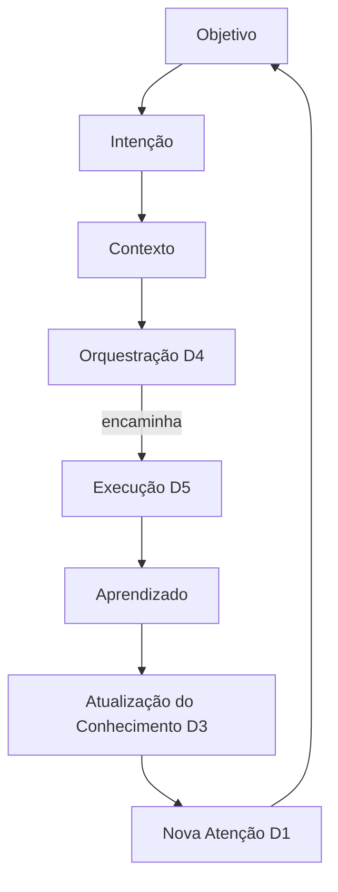
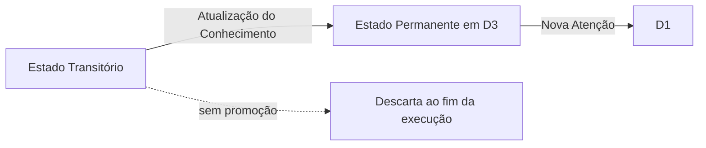
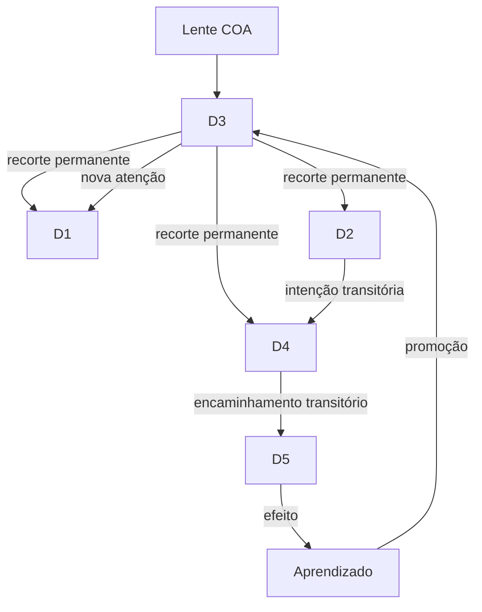
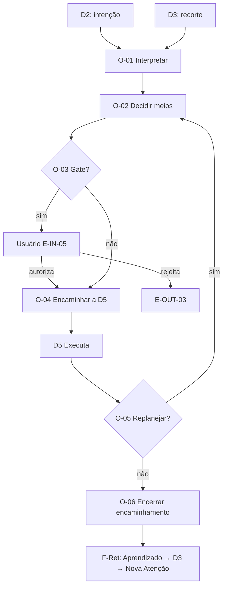
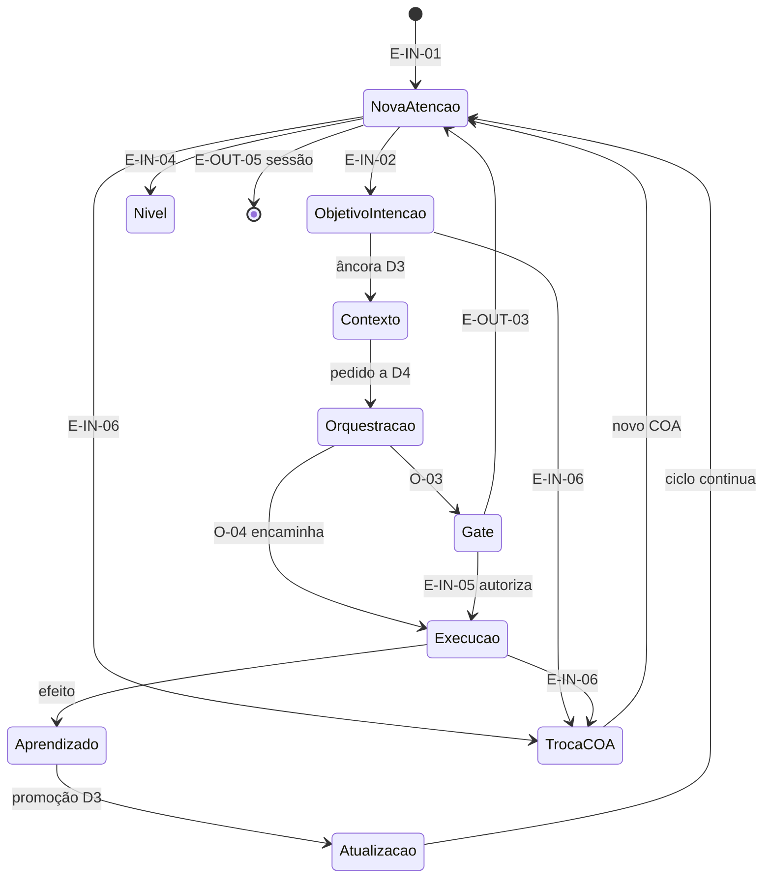

# F2-02 — Modelo de Interações da Experiência do CEO

> **Status: Homologada — Gate F2-02 APROVADO (CTO, 26/07/2026).**  
> **Aditamento CTO incorporado e homologado:** ciclo executivo contínuo; Estado Transitório vs Permanente; D4 decide e encaminha, nunca executa.  
> Pré-condição: Gate F2-01 **homologado**. Próxima capacidade: **F2-03** — Modelo de Governança da Experiência.  
> Natureza: **estritamente conceitual**.  
> Norma: CON-001; VIS-007; P1–P6; DA-001…DA-003; [`F2-01-arquitetura-conceitual-experiencia.md`](F2-01-arquitetura-conceitual-experiencia.md).  
> **Proibições:** sem novos domínios; sem commit neste registro de homologação.

---

## As quatro perguntas (ADR-002)

| Pergunta | Resposta |
|----------|----------|
| **O que é?** | O modelo que descreve **como** os domínios D1–D5 colaboram em um **ciclo executivo contínuo**: eventos, circulação de contexto, estados transitórios vs permanentes, pontos de decisão da orquestração, retorno do conhecimento e fronteiras invioláveis. |
| **Por que existe?** | F2-01 define *o que* cada domínio é; sem o *como* interagem — e sem a natureza cíclica do trabalho executivo — UX/UI arriscam reduzir o CEO a uma sequência linear de tarefas. |
| **Para quem?** | CTO (homologação); Engenheiro (insumo de F2+/F3); Usuário (transparência). |
| **Sucesso?** | Toda especificação de fluxo posterior usa este vocabulário, preserva o ciclo contínuo, distingue estados transitório/permanente e nunca atribui execução a D4. |

---

## Vocabulário deste artefato

| Termo | Significado neste documento |
|-------|------------------------------|
| **Interação** | Troca conceitual de informação, intenção, autorização ou efeito entre domínios (ou entre usuário e domínio). |
| **Ciclo executivo** | Percurso contínuo Objetivo→…→Nova Atenção; não é pipeline de tarefas com fim absoluto. |
| **Fluxo** | Trecho do ciclo (ou composição de trechos) delimitado por **eventos** de início e encerramento. |
| **Evento** | Ocorrência que inicia, altera ou encerra um fluxo. |
| **Contexto em circulação** | Recorte do COA ativo + intenção + evidências relevantes em trânsito entre domínios. |
| **Estado Transitório** | Existe apenas durante uma execução (ou trecho ativo do ciclo); não integra, por si, o patrimônio. |
| **Estado Permanente** | Integra o **patrimônio do conhecimento organizacional** do COA (DA-002). |
| **Ponto de decisão (orquestração)** | Momento em que D4 **decide e encaminha** meios — **sem executar**. |

**Não se introduzem novos domínios.** Apenas D1–D5 + lente COA (F2-01).

---

## 0. Ciclo executivo contínuo (decisão arquitetural)

O Modelo de Interações **não** representa uma sequência linear de tarefas que “termina”. Representa um **ciclo executivo contínuo**: cada volta alimenta nova atenção, novos objetivos e novo contexto.

### Fluxo conceitual mínimo (obrigatório)

```text
Objetivo
  → Intenção
    → Contexto
      → Orquestração
        → Execução
          → Aprendizado
            → Atualização do Conhecimento
              → Nova Atenção
                → (retorna a Objetivo / Intenção…)
```

### Mapeamento do ciclo aos domínios D1–D5

| Etapa do ciclo | Domínio(s) | Natureza |
|----------------|------------|----------|
| **Objetivo** | D1 (atenção) + D2 (formulação) | O que se quer alcançar / decidir |
| **Intenção** | D2 | Vontade explícita do usuário (DA-001) |
| **Contexto** | D3 → D2 / D4 | Recorte permanente + o que circula agora |
| **Orquestração** | **D4 apenas** | Decisão e encaminhamento de meios — **sem execução** |
| **Execução** | **D5 apenas** | Ação e efeito no mundo operacional |
| **Aprendizado** | D5 → D3 (e julgamento em D2/D1) | O que se compreendeu do efeito — ainda pode ser transitório até promoção |
| **Atualização do Conhecimento** | D3 | Integração ao **Estado Permanente** do COA |
| **Nova Atenção** | D3 → D1 | Quadro situacional renovado — reabre o ciclo |



**Implicações:**

1. Encerrar uma *tarefa* ou uma *execução* **não** encerra o ciclo executivo do COA.  
2. Saída da sessão de uso (interface) **não** equivale a fim do ciclo de conhecimento.  
3. “Pronto” no sentido de checklist é insuficiente; o ciclo só se renova quando há **Nova Atenção** informada por conhecimento atualizado.  
4. Trechos lineares (eventos/fluxos nomeados abaixo) são **recortes** do ciclo, não o modelo completo.

---

## 1. Como os domínios D1–D5 colaboram entre si

### 1.1 Papéis na colaboração

| Domínio | Papel na interação | Colabora principalmente com |
|---------|--------------------|-----------------------------|
| **D1** Comando e Atenção | **Quadro situacional** — Nova Atenção; convida a novo Objetivo | D3, Usuário, D2 |
| **D2** Conversa e Intenção | **Porta da vontade** — Objetivo/Intenção; diálogo de aprendizado | Usuário, D3, D4, D1 |
| **D3** Contexto e Conhecimento | **Patrimônio e recorte** — Contexto; Atualização do Conhecimento | Todos (fornece); D5 (recebe efeitos) |
| **D4** Orquestração e Delegação | **Decisão e encaminhamento de meios** — **nunca execução** | D2 (pedido), D3 (contexto), D5 (**somente** como destino do encaminhamento), Usuário (gates) |
| **D5** Execução e Efeito | **Único executor** — Execução; produz efeito para Aprendizado | D4 (recebe encaminhamento), D3 (devolução), D1 (via D3) |

### 1.2 Matriz de colaboração (quem → quem)

| De \ Para | D1 | D2 | D3 | D4 | D5 |
|-----------|----|----|----|----|-----|
| **D1** | — | Convida à intenção a partir da atenção | Consulta nível / detalhe (DA-003) | — (não roteia meios) | — |
| **D2** | Atualiza foco conversacional | — | Lê âncora do COA; propõe o que tornar permanente | Formula pedido de meios (DA-001) | — (**não** executa) |
| **D3** | Empurra atenção / estado | Empurra contexto à conversa | — | Empurra contexto para decisão de meios | — |
| **D4** | — | Informa estado de encaminhamento (sem expor meios como escolha do usuário) | Pode **ler** recorte; **não** grava patrimônio no lugar de D3; **não** executa | — | **Apenas encaminha** execução autorizada |
| **D5** | — | Pode sinalizar progresso observável | **Devolve** efeitos / evidências (DA-002) | Reporta conclusão / bloqueio / necessidade de gate | — |

**Regra de colaboração:** o usuário interage conceitualmente com **D1 e D2**; D4 é *decisão/encaminhamento*; D5 é *execução*; D3 é *fonte e destino do permanente*.

### 1.3 Padrões de colaboração no ciclo

| Padrão | Trecho do ciclo | Domínios |
|--------|-----------------|----------|
| **Abrir o posto** | Nova Atenção (entrada) | Usuário → D1 ← D3 |
| **Declarar objetivo / intenção** | Objetivo → Intenção | Usuário → D2 ↔ D3 |
| **Ancorar contexto** | Contexto | D3 → D2 / D4 |
| **Orquestrar** | Orquestração | D2 → D4 ← D3 (**D4 não executa**) |
| **Executar** | Execução | D4 → D5 |
| **Aprender e atualizar** | Aprendizado → Atualização | D5 → D3 (+ D2/D1 no julgamento) |
| **Renovar atenção** | Nova Atenção | D3 → D1 → (novo Objetivo…) |
| **Navegar níveis** | Dentro de Contexto / Atenção | D1 ↔ D3 (DA-003); ciclo não quebra |
| **Gate humano** | Antes ou durante Orquestração/Execução | D4 ⟲ Usuário via D1/D2 (P1) |
| **Trocar COA** | Interrompe recortes; reinicia atenção no novo COA | Lente COA em D1–D5 |

---

## 2. Dois tipos de estado (decisão arquitetural)

Toda informação em circulação ou armazenada no modelo pertence a **exatamente uma** destas classes conceituais — ou atravessa uma **promoção** explícita da primeira para a segunda.

### 2.1 Estado Transitório

| Aspecto | Definição |
|---------|-----------|
| **O que é** | Estado que **existe apenas durante uma execução** (ou trecho ativo correspondente: intenção em curso, plano de meios, execução em andamento, aprendizado ainda não consolidado). |
| **Onde vive tipicamente** | D2 (thread da intenção), D4 (plano de encaminhamento), D5 (andamento da execução), partes efêmeras do diálogo |
| **O que não é** | Patrimônio organizacional; fonte confiável para Nova Atenção futura sem consolidação |
| **Fim de vida** | Encerra com o fim da execução / cancelamento / troca de COA / saída do trecho — **sem** obrigação de persistir |

### 2.2 Estado Permanente

| Aspecto | Definição |
|---------|-----------|
| **O que é** | Estado que **integra o patrimônio do conhecimento organizacional** do COA. |
| **Onde vive** | **D3** (canônico) |
| **O que inclui** | Contexto do COA, decisões e fundamentos relevantes, efeitos consolidados, evidências promovidas, memória que sobrevive a tarefas e conversas (DA-002) |
| **Fim de vida** | Não se apaga por fim de execução nem por saída de sessão; só por governança explícita do patrimônio (fora do escopo deste artefato) |

### 2.3 Promoção Transitório → Permanente

| Regra | Conteúdo |
|-------|----------|
| **Quem promove** | Conceitualmente, o ciclo na etapa **Atualização do Conhecimento** (D3), alimentada por Aprendizado a partir de D5 e julgamento em D1/D2 |
| **O que não promove automaticamente** | Plano de orquestração; andamento bruto da execução; conversa completa; qualquer rastro cujo único fim foi viabilizar a execução |
| **Relação com F-Ret** | O retorno do conhecimento é o **caminho formal** de promoção ao permanente |



---

## 3. Eventos que iniciam e encerram fluxos

Eventos delimitam **trechos** do ciclo contínuo — não o “fim” do trabalho executivo do COA.

### 3.1 Eventos de início

| ID | Evento | Origem | Trecho / fluxo | Domínios |
|----|--------|--------|----------------|----------|
| **E-IN-01** | Entrar no posto / abrir o dia | Usuário | Situação → Nova Atenção | D1 ← D3 |
| **E-IN-02** | Declarar objetivo / intenção | Usuário (D2) | Objetivo → Intenção → Contexto → Orquestração | D2 ↔ D3 → D4 |
| **E-IN-03** | Selecionar item de atenção | Usuário (D1) | Aprofundamento de Contexto | D1 ↔ D3 → (opc.) D2 |
| **E-IN-04** | Mudar nível de abstração | Usuário | Navegação de nível | D1 ↔ D3 |
| **E-IN-05** | Autorizar / rejeitar gate | Usuário | Retoma ou aborta encaminhamento/execução | D4 ↔ D5 |
| **E-IN-06** | Trocar COA | Usuário | Troca de contexto | Lente em D1–D5 |
| **E-IN-07** | Sinal de efeito relevante ao COA | D5 / mundo | Aprendizado → Atualização → Nova Atenção | D5 → D3 → D1 |

### 3.2 Eventos de encerramento (de *trechos*, não do ciclo do COA)

| ID | Evento | O que encerra | Observação |
|----|--------|---------------|------------|
| **E-OUT-01** | Intenção satisfeita ou descartada | Trecho Intenção→Meios | O ciclo do COA **continua** via Nova Atenção |
| **E-OUT-02** | Execução concluída com promoção a D3 | Trecho Execução + Atualização | Alimenta Nova Atenção |
| **E-OUT-03** | Gate rejeitado / execução cancelada | Trecho Execução | Estado Transitório encerra; cancelamento relevante pode virar Permanente |
| **E-OUT-04** | Troca de COA | Trechos do COA anterior | Permanente permanece isolado no COA de origem |
| **E-OUT-05** | Saída do posto (sessão) | Trechos de interface | **Não** apaga Estado Permanente |
| **E-OUT-06** | Nível estabilizado | Trecho de navegação | Mesmo COA; ciclo intacto |

### 3.3 Fluxos nomeados (recortes do ciclo)

| Fluxo | Etapas do ciclo cobertas | Núcleo | Encerramento típico |
|-------|--------------------------|--------|---------------------|
| **F-Sit** Situação | Nova Atenção (entrada) | D1 ← D3 | E-OUT-05 / E-IN-06 |
| **F-Int** Intenção→Orquestração | Objetivo→Intenção→Contexto→Orquestração | D2 ↔ D3 → D4 | E-OUT-01 ou segue a F-Exe |
| **F-Niv** Navegação de Nível | Contexto / Atenção | D1 ↔ D3 | E-OUT-06 |
| **F-Exe** Execução | Execução | D4 **encaminha** → D5 **executa** | E-OUT-02 / E-OUT-03 |
| **F-Ret** Retorno / Atualização | Aprendizado→Atualização→Nova Atenção | D5 → D3 → D1 | D1 renovado |
| **F-Coa** Troca de COA | Reinício da lente | Todos | E-OUT-04 |

**F-Coa prevalece** sobre os demais trechos do COA anterior. Aninhamento é permitido (F-Int → F-Exe → F-Ret), sempre como volta do ciclo contínuo.

---

## 4. Circulação do contexto entre os domínios

### 4.1 O que circula

| Elemento | Classe de estado | Onde nasce | Onde pode ir |
|----------|------------------|------------|--------------|
| Identidade do COA | Permanente (lente) | Lente COA | Todos (obrigatório) |
| Quadro de atenção | Permanente projetado em D1 | D3 → D1 | Usuário; novo Objetivo |
| Objetivo / intenção em curso | **Transitório** (até consolidar) | D2 | D3 (leitura); D4 (pedido) |
| Recorte de conhecimento | Permanente (leitura) | D3 | D1, D2, D4 |
| Nível de abstração atual | Transitório de navegação | D1↔D3 | Mantido até E-IN-04 |
| Plano de encaminhamento | **Transitório** | D4 | D5 apenas |
| Andamento da execução | **Transitório** | D5 | Relatos; não é patrimônio |
| Efeito / evidência promovida | **Permanente** após Atualização | D5 → D3 | D1 (Nova Atenção) |

### 4.2 Regras de circulação

1. Todo contexto operável carrega a identidade do COA ativo.  
2. **D3 é o hub do Permanente.** Outros domínios leem recortes; só a Atualização do Conhecimento promove ao patrimônio (DA-002).  
3. **D2 transporta** intenção; não é armazém permanente.  
4. **D4 recebe contexto para decidir e encaminhar**; não acumula patrimônio; **não executa**.  
5. **D5 não mistura COAs** e não retém Permanente de outro COA.  
6. Mudança de nível (DA-003) altera o recorte, não a identidade do COA.  
7. Troca de COA **cessa** a circulação do COA anterior.  
8. Estado Transitório **não** atravessa troca de COA como se fosse Permanente.



---

## 5. Pontos de decisão da orquestração (D4)

**Decisão arquitetural:** D4 possui responsabilidade de **decisão e encaminhamento**, **nunca de execução**.

Executar é **exclusivo de D5**. Qualquer descrição em que D4 “faça” o trabalho operacional viola este modelo.

| ID | Ponto | Entrada | Saídas | Proibição |
|----|-------|---------|--------|-----------|
| **O-01** | Interpretar pedido de meios | Intenção (D2) + recorte (D3) | Encaminhar; pedir esclarecimento via D2; recusar escopo | Usuário não escolhe o meio |
| **O-02** | Decidir meios | Pedido interpretado + governança | Encaminhamento a um ou mais meios internos | D1/D2 não são seletores |
| **O-03** | Exigir gate humano? | Risco, irreversibilidade, ambiguidade (P1) | Pausar (E-IN-05) ou seguir | D5 não ignora O-03 |
| **O-04** | **Encaminhar** a D5 | Meios decididos + autorização | Início de F-Exe em **D5** | D4 **não** executa o trabalho |
| **O-05** | Replanejar / reencaminhar | Bloqueio ou necessidade de outro meio | Novo O-02/O-03; ou E-OUT-03 | Usuário não gerencia o replanejamento interno |
| **O-06** | Encerrar encaminhamento | Conclusão ou cancelamento reportado por D5 | Dispara F-Ret ou encerra sem promoção indevida | — |

### 5.1 Princípios de D4

* **Decidir ≠ Executar.** O-01…O-06 são deliberação e roteamento.  
* **Encaminhar ≠ Realizar.** Após O-04, apenas D5 realiza.  
* **Invisibilidade de meios:** o usuário vê o CEO cumprir a intenção, não um painel de orquestração.  
* **Substituibilidade dos meios:** a *forma* dos meios pode mudar sem alterar este modelo conceitual.  
* **Sem atalho D2→D5:** toda execução passa por decisão/encaminhamento de D4.  
* **Trace de O-01…O-06 é Estado Transitório** até (e se) houver promoção explícita em D3.



---

## 6. Fluxo de retorno do conhecimento

Realiza, no plano das interações, as etapas **Aprendizado → Atualização do Conhecimento → Nova Atenção** (DA-002).

### 6.1 Ciclo de retorno (F-Ret)

| Etapa | Interação | Classe de estado |
|-------|-----------|------------------|
| 1 | D5 → (Aprendizado) | Efeito ainda **transitório** até consolidar |
| 2 | Aprendizado → D3 (Atualização) | **Promoção** ao Permanente do mesmo COA |
| 3 | D3 → D1 (Nova Atenção) | Permanente projetado no quadro situacional |
| 4 | (Opcional) D1/D2 | Continuidade conversacional — **sem** confundir diálogo com patrimônio |

### 6.2 O que promove vs. o que permanece transitório

| Torna-se Permanente em D3 | Permanece Transitório / não substitui D3 |
|---------------------------|------------------------------------------|
| Decisões e fundamentos relevantes (considera HP-006) | Plano bruto de orquestração |
| Efeitos operacionais ligados ao COA | Andamento completo da execução |
| Cancelamentos/rejeições de gate relevantes | Conteúdo de outro COA |
| Mudanças que alteram a Nova Atenção | Métricas soltas sem ligação a objetivo/decisão (tensão HP-005) |

### 6.3 Retorno assíncrono (E-IN-07)

1. O efeito entra no ciclo na etapa Execução/Aprendizado.  
2. Segue F-Ret até Nova Atenção.  
3. Se o usuário estiver noutro COA, a promoção permanece no **COA de origem** — sem fundir patrimônios. (Detalhe de superfície: F3.)

### 6.4 Saída de sessão (E-OUT-05)

Não apaga Estado Permanente. Não encerra o ciclo executivo do COA — apenas os trechos de interface.

---

## 7. Fronteiras conceituais que não podem ser violadas

| ID | Fronteira | Violação típica | Correção |
|----|-----------|-----------------|----------|
| **B-01** | Um COA ativo; sem mistura | Uso de permanente/efeito de outro COA | F-Coa; isolamento |
| **B-02** | Objetivo/intenção antes da ferramenta (DA-001) | Início por escolha de meio | Entrada via D1/D2; meios só em D4 |
| **B-03** | D2 não executa | D2 dispara D5 sem D4 | O-01…O-04 |
| **B-04** | D4 não é interface principal | Usuário “opera a orquestração” como tarefa central | Gates via D1/D2 |
| **B-05** | **D4 nunca executa** | D4 realiza o trabalho operacional | Apenas decisão e encaminhamento; execução = D5 |
| **B-06** | D4 não é patrimônio | Trace de orquestração vira memória no lugar de D3 | Transitório ≠ Permanente; F-Ret |
| **B-07** | D5 não engole o ciclo | Execução sem Aprendizado/Atualização | Toda F-Exe conclui com F-Ret ou E-OUT-03 consciente |
| **B-08** | Conhecimento sobrevive (DA-002) | Fim de execução/sessão apaga D3 | Permanente ≠ Transitório |
| **B-09** | Nível ≠ troca de COA (DA-003) | Mudar nível mistura COA | F-Niv preserva identidade |
| **B-10** | Controle humano (P1) | O-03 contornado | Gate E-IN-05 |
| **B-11** | Ciclo contínuo ≠ pipeline de tarefas | Modelo tratado como lista linear com fim | Sempre fechar em Nova Atenção |
| **B-12** | Sem domínio novo | Criar “D6” ad hoc | Estender interação em D1–D5 |

**Precedência:** B-01 > B-10 > B-05 > B-02 > B-11 > demais.

---

## 8. Síntese: ciclo contínuo e trechos



---

## 9. Fora de escopo (estrito)

Este artefato **não** introduz nem discute:

* tecnologias, stacks, protocolos;  
* modelos de IA ou provedores;  
* APIs, schemas, bancos;  
* agentes ou ferramentas nomeadas;  
* requisitos (REQ), ADRs, arquitetura técnica;  
* wireframes, layouts, copy de interface;  
* novos domínios além de D1–D5.

---

## 10. Deliberação do CTO (Gate F2-02 — homologado)

| Item | Registro |
|------|----------|
| Ciclo executivo contínuo | ✅ Homologado |
| Estado Transitório / Permanente | ✅ Homologado |
| D4 decide e encaminha, nunca executa | ✅ Homologado |
| Próxima capacidade | **F2-03** — Modelo de Governança da Experiência |

---

## Memória Organizacional

| Campo | Registro |
|-------|----------|
| Quem | Engenheiro (Cursor); CTO (Gate F2-02 homologado) |
| Quando | 26/07/2026 |
| Por quê | Gate F2-02 + Aditamento — Modelo de Interações |
| Baseado em quê | F2-01; DA-001…003; deliberação CTO |
| Resultado | Homologada v0.2; F2-03 aberta; sem commit |
