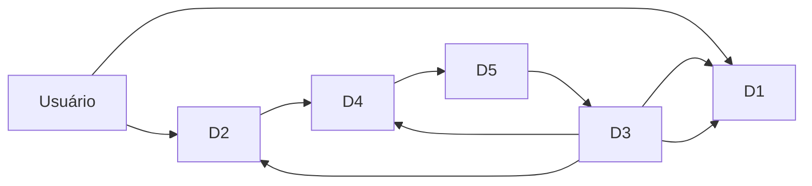
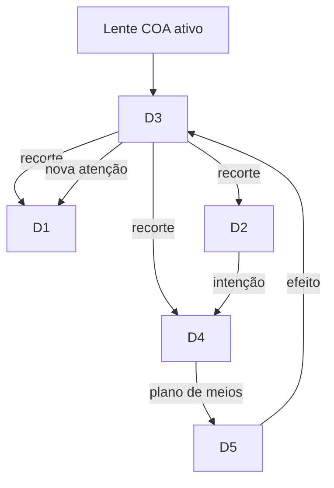
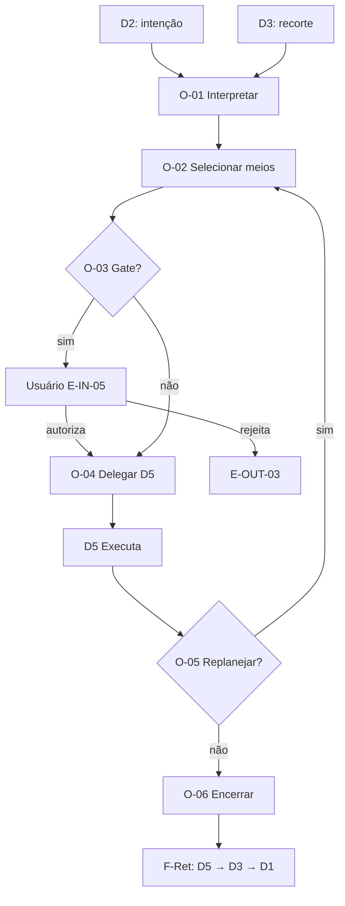
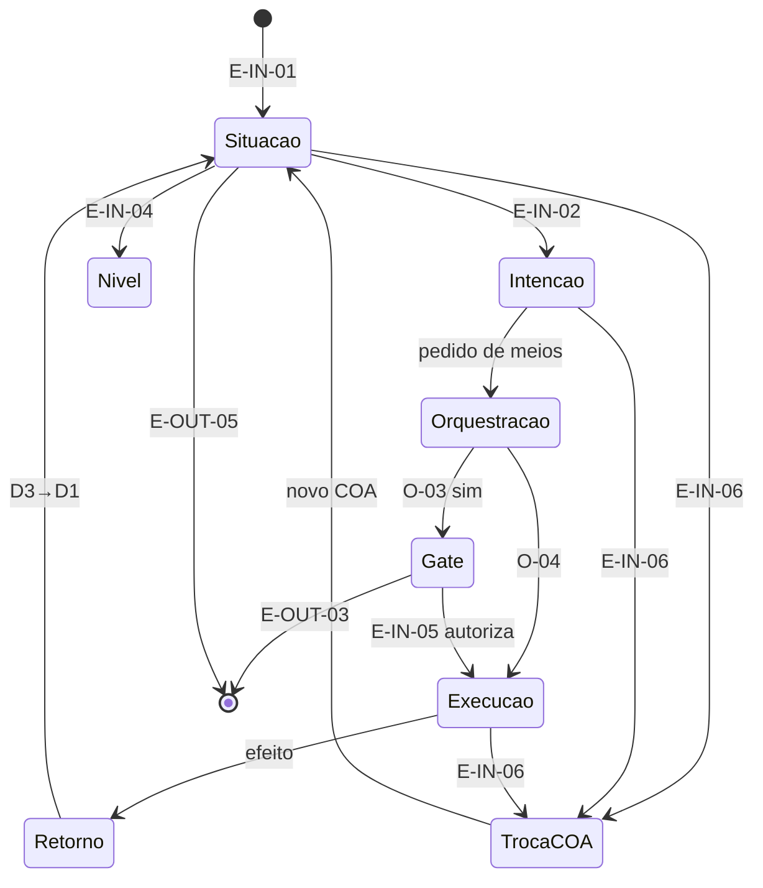

# F2-02 — Modelo de Interações da Experiência do CEO

> **Status: Em revisão do CTO — Gate F2-02 (v0.1, 26/07/2026).**  
> Pré-condição: Gate F2-01 **homologado** — Modelo D1–D5 + COA como lente transversal oficiais.  
> Natureza: **documento conceitual** de interações entre domínios — sem novos domínios; sem tecnologia; sem implementação.  
> Norma: CON-001; VIS-007; P1–P6; DA-001…DA-003; [`F2-01-arquitetura-conceitual-experiencia.md`](F2-01-arquitetura-conceitual-experiencia.md).  
> **Proibições:** sem novos domínios; sem REQ; sem ARQ técnica; sem wireframes; sem ADR; sem código; sem commit.

---

## As quatro perguntas (ADR-002)

| Pergunta | Resposta |
|----------|----------|
| **O que é?** | O modelo que descreve **como** os domínios D1–D5 colaboram: eventos que abrem/fecham fluxos, circulação do contexto, pontos de decisão da orquestração, retorno do conhecimento e fronteiras invioláveis. |
| **Por que existe?** | F2-01 define *o que* cada domínio é; sem o *como* interagem, UX/UI e fundações visuais arriscam inventar fluxos que misturam camadas ou quebram o COA. |
| **Para quem?** | CTO (homologação); Engenheiro (insumo de F2+/F3); Usuário (transparência). |
| **Sucesso?** | Toda especificação de fluxo posterior situa-se neste vocabulário de interações, sem criar domínio novo nem violar as fronteiras §6. |

---

## Vocabulário deste artefato

| Termo | Significado neste documento |
|-------|------------------------------|
| **Interação** | Troca conceitual de informação, intenção, autorização ou efeito entre dois ou mais domínios (ou entre usuário e domínio). |
| **Fluxo** | Sequência ordenada de interações com início e fim definidos por **eventos**. |
| **Evento** | Ocorrência que inicia, altera ou encerra um fluxo (ação do usuário, sinal de domínio ou mudança de COA). |
| **Contexto em circulação** | Recorte do COA ativo + intenção + evidências relevantes que atravessa os domínios durante um fluxo. |
| **Ponto de decisão (orquestração)** | Momento em que D4 escolhe, restringe ou pausa meios — **sem** expor escolha de ferramenta ao usuário. |

**Não se introduzem novos domínios.** Apenas D1–D5 + lente COA (F2-01).

---

## 1. Como os domínios D1–D5 colaboram entre si

### 1.1 Papéis na colaboração

| Domínio | Papel na interação | Colabora principalmente com |
|---------|--------------------|-----------------------------|
| **D1** Comando e Atenção | **Quadro situacional** — mostra o que importa; recebe atualizações pós-efeito | D3 (alimento), Usuário (leitura), D2 (ponte para intenção) |
| **D2** Conversa e Intenção | **Porta de entrada da vontade** — formula objetivo; solicita meios | Usuário, D3 (âncora), D4 (pedido de meios), D1 (continuidade) |
| **D3** Contexto e Conhecimento | **Memória e recorte** — fornece e recebe; isola por COA | Todos (fornece); D5 (recebe efeitos); D1 (atenção) |
| **D4** Orquestração e Delegação | **Mediador de meios** — decide *como* cumprir a intenção | D2 (pedido), D3 (contexto para escolher meios), D5 (delegação), Usuário (só via gates de aprovação, nunca via seletor) |
| **D5** Execução e Efeito | **Ator operacional** — executa e devolve consequência | D4 (manda), D3 (devolve), D1 (indiretamente via D3) |

### 1.2 Matriz de colaboração (quem → quem)

| De \ Para | D1 | D2 | D3 | D4 | D5 |
|-----------|----|----|----|----|-----|
| **D1** | — | Convida à intenção a partir da atenção | Consulta nível / detalhe (DA-003) | — (não roteia meios) | — |
| **D2** | Atualiza foco conversacional do quadro | — | Lê âncora do COA; propõe o que registrar | Formula pedido de meios (DA-001) | — (não executa direto) |
| **D3** | Empurra atenção / estado | Empurra contexto à conversa | — | Empurra contexto para escolha de meios | — |
| **D4** | — | Informa estado de delegação (opaco quanto a provedor) | Pode solicitar leitura; **não** grava patrimônio no lugar de D3 | — | Delega execução autorizada |
| **D5** | — | Pode sinalizar progresso observável (via superfície) | **Devolve** efeitos / evidências (DA-002) | Reporta conclusão / bloqueio / necessidade de gate | — |

**Regra de colaboração:** o usuário interage conceitualmente com **D1 e D2**; D4 e D5 são *backstage* da experiência; D3 é *fonte e destino* do que sobrevive.

### 1.3 Padrões de colaboração recorrentes

| Padrão | Sequência | Para que serve |
|--------|-----------|----------------|
| **Abrir o posto** | Usuário → D1 ← D3 | Situar atenção no COA ativo |
| **Declarar objetivo** | Usuário → D2 ↔ D3 | Intenção antes da ferramenta (DA-001) |
| **Descer / subir nível** | Usuário ↔ D1 ↔ D3 | Navegação de abstração (DA-003) sem trocar COA |
| **Pedir meios** | D2 → D4 ← D3 | Orquestração invisível |
| **Executar e fechar o ciclo** | D4 → D5 → D3 → D1 | Efeito vira conhecimento e nova atenção (DA-002) |
| **Gate humano** | D4/D5 ⟲ Usuário (via D2/D1) | Controle (P1) antes de ação arriscada |
| **Trocar COA** | Usuário → (lente COA) → recorte novo de D1–D5 | Isolamento; encerra fluxos do COA anterior |

---

## 2. Eventos que iniciam e encerram fluxos

### 2.1 Catálogo de eventos de início

| ID | Evento | Origem típica | Fluxo que inicia | Domínios acionados |
|----|--------|---------------|------------------|--------------------|
| **E-IN-01** | Entrar no posto / abrir o dia | Usuário | Fluxo de Situação | D1 ← D3 |
| **E-IN-02** | Declarar intenção / objetivo | Usuário (D2) | Fluxo de Intenção→Meios | D2 ↔ D3 → D4 |
| **E-IN-03** | Selecionar item de atenção | Usuário (D1) | Fluxo de Aprofundamento | D1 ↔ D3 → (opcional) D2 |
| **E-IN-04** | Pedir mudança de nível de abstração | Usuário | Fluxo de Navegação de Nível | D1 ↔ D3 |
| **E-IN-05** | Autorizar / rejeitar gate | Usuário | Retoma ou aborta Fluxo de Execução | D4 ↔ D5 |
| **E-IN-06** | Trocar COA | Usuário | Fluxo de Troca de Contexto | Lente COA em D1–D5 |
| **E-IN-07** | Sinal externo de efeito (ex.: resultado operacional relevante ao COA) | D5 / mundo | Fluxo de Retorno de Conhecimento | D5 → D3 → D1 |

### 2.2 Catálogo de eventos de encerramento

| ID | Evento | O que encerra | Condição |
|----|--------|---------------|----------|
| **E-OUT-01** | Intenção satisfeita ou descartada pelo usuário | Fluxo de Intenção→Meios (e execução associada, se houver) | Decisão explícita do usuário (P1) |
| **E-OUT-02** | Execução concluída com efeito registrado em D3 | Fluxo de Execução | D5 → D3 ocorreu; D1 pode refletir novo estado |
| **E-OUT-03** | Gate rejeitado / execução cancelada | Fluxo de Execução | Sem efeito patrimonial indevido; rastro de cancelamento pode ir a D3 |
| **E-OUT-04** | Troca de COA | **Todos** os fluxos do COA anterior | Recorte anterior deixa de ser operável; patrimônio permanece isolado no COA de origem |
| **E-OUT-05** | Saída do posto (sessão de uso) | Fluxos de interface ativos | **Não** apaga D3 (DA-002); não encerra patrimônio |
| **E-OUT-06** | Navegação de nível concluída (usuário estabiliza em um nível) | Fluxo de Navegação de Nível | Mesmo COA; contexto contínuo |

### 2.3 Fluxos nomeados (composições)

| Fluxo | Início | Encerramento típico | Núcleo |
|-------|--------|---------------------|--------|
| **F-Sit** Situação | E-IN-01 | E-OUT-05 ou E-IN-06 | D1 ← D3 |
| **F-Int** Intenção→Meios | E-IN-02 | E-OUT-01 ou segue para F-Exe | D2 ↔ D3 → D4 |
| **F-Niv** Navegação de Nível | E-IN-04 (ou E-IN-03) | E-OUT-06 | D1 ↔ D3 |
| **F-Exe** Execução | D4 autoriza após F-Int (e E-IN-05 se gate) | E-OUT-02 ou E-OUT-03 | D4 → D5 → D3 |
| **F-Ret** Retorno de Conhecimento | E-IN-07 ou fim de F-Exe | D1 atualizado | D5 → D3 → D1 |
| **F-Coa** Troca de COA | E-IN-06 | E-OUT-04 | Lente em todos |

**Nota:** fluxos podem aninhar-se (ex.: F-Int dispara F-Exe; F-Exe dispara F-Ret). Troca de COA (**F-Coa**) **prevalece** e encerra os demais do COA anterior.

---

## 3. Circulação do contexto entre os domínios

### 3.1 O que circula

| Elemento de contexto | Descrição conceitual | Onde nasce | Onde pode ir |
|----------------------|----------------------|------------|--------------|
| **Identidade do COA** | Qual contexto operacional está ativo | Lente COA | Todos os domínios (obrigatório) |
| **Quadro de atenção** | O que exige foco agora | D3 → D1 | Usuário; pode gerar intenção em D2 |
| **Intenção / objetivo** | O que o usuário quer decidir ou alcançar | D2 (usuário) | D3 (âncora); D4 (pedido de meios) |
| **Recorte de conhecimento** | Evidências, memória, estado do COA no nível atual | D3 | D1, D2, D4 |
| **Nível de abstração** | Posição na escala empresa→…→evidências | D1↔D3 (usuário) | Mantido na circulação até nova E-IN-04 |
| **Plano de meios** | Escolha interna de agentes/capacidades | D4 | D5 (não exposto como seletor) |
| **Efeito / evidência de resultado** | O que mudou após execução | D5 | **Obrigatoriamente** D3; depois D1 |

### 3.2 Regras de circulação

1. **Todo contexto operável carrega a identidade do COA ativo.** Ausência de COA = estado inválido.  
2. **D3 é o hub de persistência.** Outros domínios *leem* recortes; só o retorno formal a D3 faz o conhecimento **sobreviver** (DA-002).  
3. **D2 não é armazém.** A conversa *transporta* intenção e pode *propor* registros; o patrimônio fica em D3.  
4. **D4 recebe contexto para decidir meios**, não para acumular memória organizacional.  
5. **D5 não retém contexto de COA alheio** nem mistura efeitos entre COAs.  
6. **Mudança de nível (DA-003)** altera o *recorte* circulante, não a identidade do COA.  
7. **Ao trocar COA**, a circulação do COA anterior **cessa**; nenhum elemento cruza a fronteira.

---

## 4. Pontos de decisão da orquestração

Pontos em que **D4** decide — sempre a serviço da intenção (DA-001), nunca como UI de toolbox.

| ID | Ponto de decisão | Entrada conceitual | Saídas possíveis | Quem **não** decide |
|----|------------------|--------------------|------------------|---------------------|
| **O-01** | **Interpretar pedido de meios** | Intenção (D2) + recorte (D3) | Encaminhar a capacidade/agente; pedir esclarecimento via D2; recusar por fora de escopo | Usuário não escolhe o provedor |
| **O-02** | **Selecionar meios** | Pedido interpretado + políticas de governança | Um ou mais meios internos; composição de especialistas | Usuário / D1 / D2 como seletor |
| **O-03** | **Exigir gate humano?** | Risco, irreversibilidade, ambiguidade (P1) | Pausar → E-IN-05; ou seguir | D5 não ignora gate determinado em O-03 |
| **O-04** | **Delegar a D5** | Meios escolhidos + autorização | Início de F-Exe | D2 não dispara D5 diretamente |
| **O-05** | **Replanejar / handoff interno** | Bloqueio, falha parcial, necessidade de especialista | Novo meio; novo gate; encerrar com E-OUT-03 | Usuário não gerencia handoff técnico |
| **O-06** | **Encerrar delegação** | Conclusão ou cancelamento de D5 | Dispara F-Ret (efeito → D3) ou encerra sem efeito patrimonial | — |

### 4.1 Princípios dos pontos O-01…O-06

* **Invisibilidade de provedor:** o resultado aparece em D1/D2/D5 como ação do CEO, não como “usei o modelo X”.  
* **Substituibilidade:** a lógica de O-02 pode mudar de implementação sem mudar este modelo (ADR-010).  
* **Controle humano:** O-03 existe para preservar P1; aprovação circula pelo usuário via D2/D1, não via painel de orquestração.  
* **Sem atalho D2→D5:** toda execução passa por decisão de D4 (ainda que trivial).

---

## 5. Fluxo de retorno do conhecimento

O retorno é o mecanismo que realiza **DA-002** no plano das interações: o que aconteceu **não morre** na execução nem no chat.

### 5.1 Ciclo de retorno (F-Ret)

| Etapa | Interação | Conteúdo que retorna |
|-------|-----------|----------------------|
| 1 | D5 → D3 | Efeito observável, evidência, resultado de gate, cancelamento relevante |
| 2 | D3 consolida | Integra ao patrimônio do **mesmo COA**; distingue rastro efêmero de registro que sobrevive |
| 3 | D3 → D1 | Novo quadro de atenção / o que mudou |
| 4 | (Opcional) D1 → Usuário / D2 | Continuidade da conversa sobre o efeito — sem confundir thread com memória |

### 5.2 O que deve retornar vs. o que não deve

| Deve retornar a D3 | Não deve substituir D3 |
|--------------------|------------------------|
| Decisões e seus fundamentos quando houver (considera HP-006) | Log bruto de orquestração como “conhecimento do produto” |
| Efeitos no mundo operacional ligados ao COA | Histórico completo de tokens/sessão de agente |
| Cancelamentos e rejeições de gate relevantes | Conteúdo de outro COA |
| Mudanças de estado que alteram a atenção (D1) | Métricas soltas sem ligação a objetivo/decisão (tensão HP-005) |

### 5.3 Retorno assíncrono (E-IN-07)

Quando o efeito chega depois (mundo externo, trabalho longo):

1. Evento E-IN-07 entra por D5 (ou equivalente conceitual).  
2. Segue o mesmo F-Ret: D5 → D3 → D1.  
3. Se o usuário estiver em outro COA, o retorno **permanece no COA de origem**; D1 do COA ativo **não** mistura o sinal (pode, no máximo, haver indicador de “outro contexto tem novidade” — sem fundir patrimônios). *Detalhe de UX fica para F3; a regra conceitual é o isolamento.*

### 5.4 Relação com saída de sessão (E-OUT-05)

Encerrar o uso **não** dispara apagamento de D3. F-Ret já deve ter ocorrido para execuções concluídas; pendências ficam no COA para o próximo E-IN-01.

---

## 6. Fronteiras conceituais que não podem ser violadas

Herdam e operacionaisizam F2-01 §6 no plano das **interações**.

| ID | Fronteira | Violação típica | Correção conceitual |
|----|-----------|-----------------|---------------------|
| **B-01** | Um COA ativo; sem mistura | Fluxo usa conhecimento ou efeito de outro COA | F-Coa explícito; circulação isolada |
| **B-02** | Intenção antes da ferramenta (DA-001) | Fluxo inicia por escolha de app/modelo | Início só via D1/D2; meios só em D4 |
| **B-03** | D2 não executa | D2 dispara D5 sem D4 | Sempre O-01…O-04 |
| **B-04** | D4 não é interface principal | Usuário “configura o orquestrador” como tarefa central | D4 backstage; gates via D1/D2 |
| **B-05** | D4 não é patrimônio | Trace de O-02…O-06 vira memória no lugar de D3 | Trace ≠ D3; retorno formal F-Ret |
| **B-06** | D5 não engole o ciclo | Execução sem D5→D3 | Toda F-Exe conclui com F-Ret ou E-OUT-03 consciente |
| **B-07** | Conhecimento sobrevive (DA-002) | E-OUT-05 ou fim de tarefa apaga D3 | Sessão ≠ patrimônio |
| **B-08** | Nível ≠ troca de COA (DA-003) | Mudar nível troca ou mistura COA | F-Niv mantém identidade do COA |
| **B-09** | Controle humano (P1) | O-03 contornado; ação irreversível surpresa | Gate E-IN-05 obrigatório quando O-03 exige |
| **B-10** | Sem domínio novo | Criar “D6” ad hoc em especificação futura | Estender interação dentro de D1–D5 |

**Precedência em conflito de fluxos:** B-01 (COA) > B-09 (controle) > B-02 (objetivo antes da ferramenta) > demais.

---

## 7. Síntese visual dos fluxos principais

---

## 8. Fora de escopo

* Novos domínios além de D1–D5.  
* Requisitos (REQ), ADRs, arquitetura técnica, APIs, schemas.  
* Wireframes, jornadas pixel-level, copy de UI.  
* Promoção de HP-004/005/006.  
* Decisões de implementação ou stack.

---

## 9. Pedido ao CTO (Gate F2-02)

1. Homologar o Modelo de Interações (colaboração D1–D5, eventos, circulação, O-01…O-06, F-Ret, fronteiras B-01…B-10).  
2. Confirmar que **não** há domínio adicional implícito neste artefato.  
3. Autorizar a próxima capacidade da F2 — ou indicar ajustes bloqueantes.

**Sem commit. Sem implementação.**

---

## Memória Organizacional

| Campo | Registro |
|-------|----------|
| Quem | Engenheiro (Cursor); submissão ao CTO |
| Quando | 26/07/2026 |
| Por quê | Gate F2-02 — Modelo de Interações da Experiência |
| Baseado em quê | F2-01 homologado (D1–D5 + COA); DA-001…003; P1; VIS-007 |
| Resultado | Artefato v0.1 submetido; sem novos domínios; sem REQ/ARQ/wireframes/ADR; sem commit |
