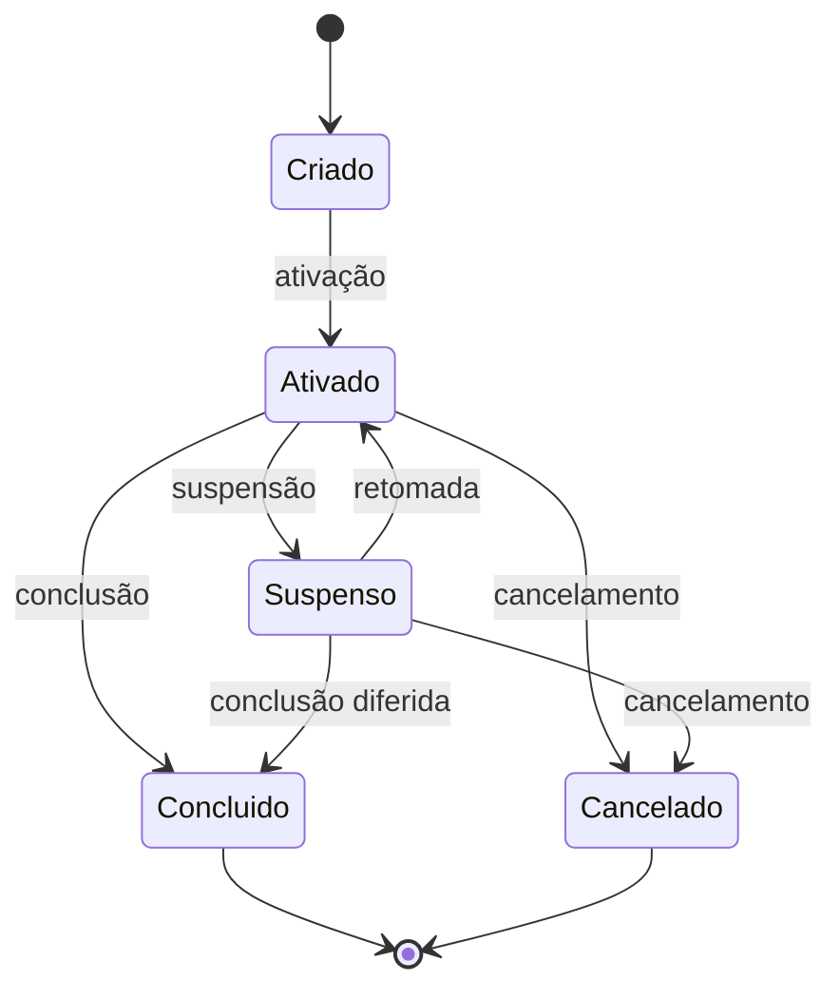
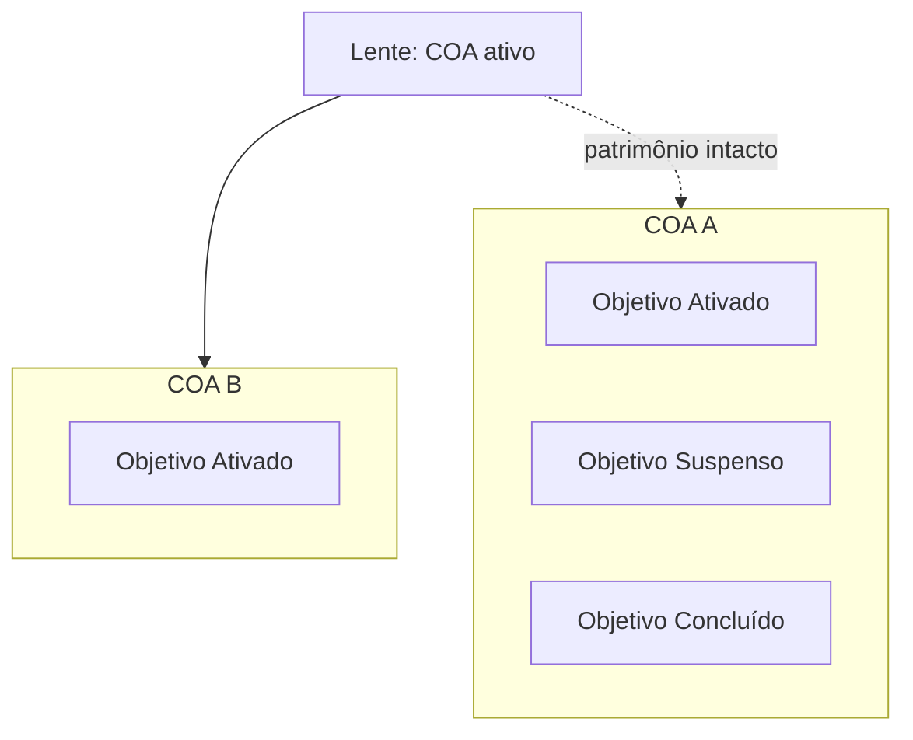
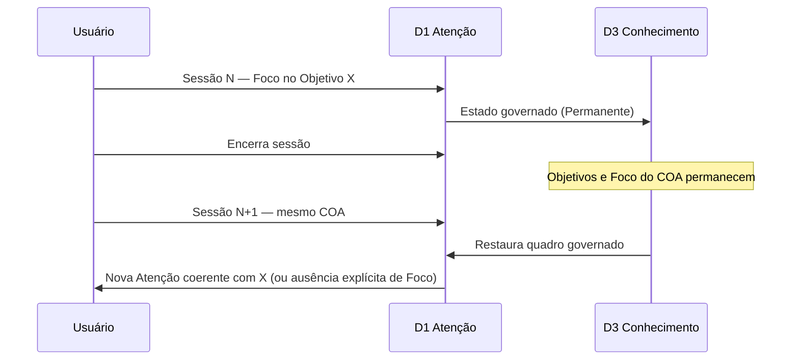

# F2-03 — Modelo de Governança da Experiência do CEO

> **Status: Homologada — Gate F2-03 APROVADO (CTO, 26/07/2026).**  
> Pré-condições: F2-01 e F2-02 **homologados**. Próxima capacidade: **F2-04** — Princípios da Experiência do CEO.  
> Natureza: **estritamente conceitual** — governança da experiência sobre objetivos, COA, atenção e continuidade.  
> Norma: CON-001; VIS-007; P1–P6; DA-001…DA-003; [`F2-01-arquitetura-conceitual-experiencia.md`](F2-01-arquitetura-conceitual-experiencia.md); [`F2-02-modelo-de-interacoes-experiencia.md`](F2-02-modelo-de-interacoes-experiencia.md).  
> **Proibições:** sem REQ; sem ARQ técnica; sem wireframes; sem tecnologias; sem commit neste registro.

---

## As quatro perguntas (ADR-002)

| Pergunta | Resposta |
|----------|----------|
| **O que é?** | O modelo que define **como a experiência governa objetivos** ao longo do tempo: ciclo de vida, prioridade, papel do COA, concorrência e foco, reflexão em D1 (Atenção) e continuidade entre sessões (DA-002). |
| **Por que existe?** | Sem governança explícita de objetivos, o ciclo executivo contínuo (F2-02) vira lista de intenções competindo sem regra — e a Atenção (D1) deixa de ser posto de comando. |
| **Para quem?** | CTO (homologação); Engenheiro (insumo F2+/F3); Usuário (transparência do governo do trabalho). |
| **Sucesso?** | Toda especificação futura de Home, foco e continuidade cita este vocabulário de estados de objetivo, prioridade e COA — sem inventar um segundo modelo de governança. |

---

## Vocabulário deste artefato

| Termo | Significado |
|-------|-------------|
| **Objetivo** | Declaração do que se quer alcançar ou decidir no âmbito de um COA (DA-001: antecede meios). Não é tarefa; não é ferramenta. |
| **Objetivo ativo** | Objetivo em curso sob o COA atual, elegível a receber atenção e ciclo executivo. |
| **Foco** | Objetivo (ou recorte dele) que a Atenção (D1) privilegia **agora**, sem extinguir os demais. |
| **Governança da experiência** | Conjunto de regras conceituais que ordenam ciclo de vida, prioridade, concorrência e continuidade dos objetivos na experiência — não é organograma nem workflow de software. |
| **Sessão** | Período contínuo de uso da interface; **não** define o ciclo de vida do conhecimento nem do objetivo permanente. |

**Sem novos domínios.** Governança opera **sobre** D1–D5 e a lente COA.

---

## 1. Ciclo de vida de um objetivo

Todo objetivo percorre estados de vida. Mudanças de estado são **atos de governança** (explícitos ou decorrentes de regras abaixo) — não efeitos colaterais de uma execução isolada.

### 1.1 Estados do ciclo de vida

| Estado | Definição | Classe típica (F2-02) |
|--------|-----------|------------------------|
| **Criado** | Objetivo formulado e reconhecido no COA; ainda não governa o trabalho corrente | Pode nascer Transitório na intenção; tende a Permanente ao ser assumido pelo COA |
| **Ativado** | Objetivo em curso; elegível a Foco e ao ciclo Objetivo→…→Nova Atenção | Permanente no COA (enquanto vigente) |
| **Suspenso** | Objetivo permanece no patrimônio do COA, mas **não** compete pelo Foco até retomada | Permanente; fora do quadro de prioridade ativa |
| **Retomado** | Transição de Suspenso → Ativado; reentra a competição por Foco | Permanente |
| **Concluído** | Objetivo atingido ou deliberadamente encerrado com êxito relativo; deixa de competir por Foco | Permanente (histórico / aprendizado) |
| **Cancelado** | Objetivo abandonado sem conclusão pretendida; deixa de competir por Foco | Permanente (registro do cancelamento, quando relevante) |

### 1.2 Significado de cada transição

| Transição | O que significa na experiência | O que **não** significa |
|-----------|--------------------------------|-------------------------|
| **Criação** | Surge um novo norte de intenção no COA (DA-001) | Escolher meios; abrir ferramenta |
| **Ativação** | O objetivo passa a poder receber ciclo executivo e Foco | Execução automática; conclusão |
| **Suspensão** | Parqueia sem apagar; libera Foco para outros | Apagar patrimônio (DA-002); cancelar |
| **Retomada** | Reabilita competição por Foco e ciclo | Criar objetivo novo (é o mesmo objetivo) |
| **Conclusão** | Encerra a vida ativa com desfecho pretendido | Apagar histórico; impedir Nova Atenção sobre o aprendizado |
| **Cancelamento** | Encerra a vida ativa sem o desfecho pretendido | Silêncio sem registro quando o cancelamento importa à governança |

### 1.3 Relação com o ciclo executivo contínuo (F2-02)

* Um objetivo **Ativado** (em Foco ou não) é o *assunto* das etapas Objetivo/Intenção do ciclo.  
* **Suspenso / Concluído / Cancelado** não disparam Orquestração nem Execução por si.  
* **Conclusão ou cancelamento** alimentam Aprendizado → Atualização do Conhecimento → Nova Atenção (o ciclo do COA **continua**; o objetivo específico encerra).  
* Múltiplas voltas do ciclo podem ocorrer sob o **mesmo** objetivo Ativado até conclusão, suspensão ou cancelamento.

---

## 2. Critérios conceituais de prioridade entre objetivos

Prioridade ordena **quais objetivos Ativados** (e, em casos excepcionais, o que reativar) merecem Foco e atenção. É julgamento executivo — não pontuação de tarefas.

### 2.1 Critérios (ordem de consideração sugerida)

| # | Critério | Pergunta-guia | Liga-se a |
|---|----------|---------------|-----------|
| **P1** | **Risco / irreversibilidade** | O atraso aumenta dano ou fecha janela? | P1 (controle); gates |
| **P2** | **Dependência** | Outros objetivos Ativados bloqueiam-se sem este? | DA-003 (níveis) |
| **P3** | **Compromisso temporal do COA** | Há prazo ou marco próprio deste contexto? | Contexto do COA |
| **P4** | **Proximidade da decisão** | Está mais perto de uma decisão do que de mera atividade? | P2; HP-005 em observação |
| **P5** | **Contribuição ao nível em vista** | No nível de abstração atual (DA-003), este objetivo é o mais alinhado? | DA-003 |
| **P6** | **Energia de continuidade** | Retomar agora aproveita contexto já aquecido na sessão/COA? | Continuidade (§6) |
| **P7** | **Declaração explícita do usuário** | O usuário elevou este objetivo ao Foco? | P1 (autoridade máxima) |

### 2.2 Regras de aplicação

1. **P7 prevalece** sobre P1–P6 quando o usuário declara Foco — salvo risco imediato que exija sinalização em D1 antes de obedecer cegamente (transparência, não tutela oculta).  
2. Objetivos **Suspensos, Concluídos ou Cancelados** não entram na ordenação de prioridade ativa.  
3. Prioridade **não** escolhe meios (DA-001 / D4).  
4. Prioridade **não** substitui o isolamento do COA: só competem objetivos do **mesmo** COA ativo.  
5. Empate entre critérios resolve-se pela **autoridade do usuário** (P1 de produto), não por automação opaca.

---

## 3. Papel do COA na governança do trabalho

O **COA (Contexto Operacional Ativo)** é a **unidade de governança** do trabalho na experiência.

| Responsabilidade do COA | Implicação |
|-------------------------|------------|
| **Recorte exclusivo** | Objetivos, prioridades, Foco e patrimônio permanente pertencem a um COA; não se misturam com outro |
| **Um COA ativo** | Em qualquer momento, a governança operável é a do COA ativo (VIS-007) |
| **Contêiner do ciclo de vida** | Criação…cancelamento de objetivos ocorre *dentro* do COA |
| **Contêiner do Permanente** | Estado Permanente dos objetivos e do aprendizado fica no COA (DA-002) |
| **Fronteira de prioridade** | Critérios §2 aplicam-se apenas entre objetivos do mesmo COA |
| **Troca de COA** | Suspende a governança *operável* do COA anterior (sem apagar seus objetivos); ativa a do novo |

**O COA não é um objetivo.** É o *palco* onde objetivos são governados.  
**Trocar COA ≠ suspender um objetivo** — embora os objetivos do COA deixem de competir pelo Foco *global da sessão* enquanto outro COA está ativo; seus estados de vida **permanecem** (Ativado no COA A continua Ativado em A, mesmo que B esteja na lente).

---

## 4. Objetivos concorrentes e mudança de foco

### 4.1 Concorrência

* Vários objetivos podem estar **Ativados** no mesmo COA.  
* Apenas **um Foco** prevalece por vez na Atenção (D1) — o privilégio de “agora”.  
* Concorrência **não** exige cancelar ou concluir os demais; o instrumento próprio é **Suspensão** ou simplesmente permanecer Ativado fora do Foco.  
* Orquestração (D4) e Execução (D5) do ciclo corrente alinham-se ao objetivo em Foco (e sua intenção), salvo gate que o usuário redirecione.

### 4.2 Mudança de foco

| Forma | Efeito no ciclo de vida | Efeito na Atenção |
|-------|-------------------------|-------------------|
| **Usuário eleva outro objetivo Ativado** | Estados de vida inalterados (salvo suspensão explícita) | D1 passa a privilegiar o novo Foco |
| **Usuário suspende o foco atual e ativa outro** | Foco antigo → Suspenso; outro → Ativado/Foco | D1 reflete o novo estado governado |
| **Conclusão / cancelamento do foco** | Foco encerra vida ativa; próximo Foco por §2 ou declaração do usuário | D1 mostra encerramento + Nova Atenção |
| **Troca de COA** | Vida dos objetivos do COA anterior preservada | D1 passa a refletir o COA novo; Foco anterior deixa de ser o quadro ativo |

### 4.3 O que a mudança de foco não faz

* Não apaga Estado Permanente (DA-002).  
* Não escolhe meios.  
* Não mistura objetivos de COAs distintos.  
* Não transforma automaticamente Ativado em Concluído.

---

## 5. Como a Atenção (D1) reflete o estado governado dos objetivos

D1 é o **espelho situacional da governança** — não o inventário completo do patrimônio.

### 5.1 O que D1 deve refletir

| Sinal em D1 | Origem na governança |
|-------------|----------------------|
| **Foco atual** | Objetivo Ativado privilegiado agora |
| **Demais Ativados (secundários)** | Concorrentes do mesmo COA — visíveis como contexto de prioridade, sem roubar o objetivo único da superfície (P6) |
| **Alertas de risco / prazo** | Critérios P1–P3 sobre Ativados |
| **Suspensos retomáveis** | Sinalização só quando relevante à Nova Atenção — não lista infinita |
| **Recém-concluídos / cancelados** | Eco breve na Nova Atenção após F-Ret — depois passam ao histórico permanente |
| **Identidade do COA ativo** | Lente de governança sempre explícita |

### 5.2 O que D1 não é

| D1 não é | Porque |
|----------|--------|
| Arquivo morto de todos os Concluídos/Cancelados | Isso é consulta a D3 (patrimônio) |
| Seletor de meios | DA-001 / D4 |
| Painel de execução | D5 |
| Mistura multi-COA | Isolamento |

### 5.3 Ligação ao ciclo contínuo

Após Atualização do Conhecimento, **Nova Atenção** em D1 deve espelhar:

1. estado de vida dos objetivos afetados;  
2. Foco vigente (ou ausência transitória até o usuário/prioridade definir);  
3. o que mudou no Permanente do COA.

Assim D1 permanece posto de comando (P1/P2), não dashboard de tarefas.

---

## 6. Continuidade entre sessões (preservando DA-002)

**DA-002:** o contexto sobrevive às tarefas, projetos e conversas. A governança da experiência estende isso aos **objetivos**.

### 6.1 O que sobrevive ao fim da sessão

| Sobrevive (Permanente no COA) | Não precisa sobreviver (Transitório) |
|-------------------------------|--------------------------------------|
| Objetivos em qualquer estado de vida já consolidado | Intenção conversacional não promovida |
| Foco declarado / último Foco governado do COA | Plano de encaminhamento (D4) |
| Priorizações explícitas relevantes | Andamento bruto de execução |
| Aprendizados promovidos | Thread completa da conversa como se fosse arquivo |

### 6.2 Regras conceituais de continuidade

1. **Encerrar sessão ≠ suspender objetivos.** Suspensão é ato de governança (§1), não efeito colateral do logout.  
2. **Encerrar sessão ≠ concluir nem cancelar.**  
3. **Reabrir sessão no mesmo COA** restaura: lente do COA, estados de vida permanentes, Foco governado (ou sua ausência explícita), quadro de Atenção derivado do Permanente — não de uma conversa efêmera perdida.  
4. **Reabrir em outro COA** aplica a lente do outro; o anterior permanece intacto.  
5. **Continuidade não reexecuta** automaticamente Orquestração/Execução pendentes sem nova Intenção ou retomada explícita do ciclo (controle P1).  
6. **Promoção pendente:** efeitos ainda Transitórios ao fechar sessão devem, na retomada, aparecer como pendência de Aprendizado/Atualização — não como se já fossem Permanente, nem como se nunca tivessem existido (*princípio de honestidade situacional*).  
7. **Histórico de Concluído/Cancelado** permanece consultável via conhecimento (D3), não necessariamente no centro de D1.

---

## 7. Síntese: governança sobre o modelo já homologado

| Artefato | O que este F2-03 acrescenta |
|----------|-----------------------------|
| F2-01 Domínios | Quem sente a governança: **D1** espelha; **D3** guarda; **D2** declara objetivos; D4/D5 não definem ciclo de vida do objetivo |
| F2-02 Interações | Objetivo é o *assunto* do ciclo contínuo; F-Coa preserva governança por COA; Transitório/Permanente aplica-se ao estado do objetivo e ao Foco |
| DA-001 | Criação/ativação de objetivo antecede meios |
| DA-002 | Continuidade entre sessões e sobrevivência pós-conclusão/cancelamento no patrimônio |
| DA-003 | Prioridade e Atenção respeitam o nível de abstração em vista |

---

## 8. Fronteiras conceituais (governança)

| ID | Fronteira | Violação | Correção |
|----|-----------|----------|----------|
| **G-01** | Objetivo ≠ tarefa ≠ meio | Governar “ferramentas” como objetivos | DA-001; meios em D4 |
| **G-02** | Foco ≠ único Ativado | Cancelar concorrentes ao focar | Suspensão ou Ativado fora de Foco |
| **G-03** | COA ≠ objetivo | Tratar COA como item de prioridade entre objetivos | COA é lente/contêiner |
| **G-04** | Sessão ≠ ciclo de vida | Logout suspende/apaga objetivos | §6 |
| **G-05** | D1 ≠ arquivo | Despejar todo o patrimônio em D1 | D1 espelha estado governado; D3 guarda |
| **G-06** | Prioridade ≠ orquestração | Usar §2 para escolher meios | §2 só ordena objetivos |
| **G-07** | Sem domínio novo | Criar “D6 Governança” | Governança é regime sobre D1–D5 |

---

## 9. Fora de escopo (estrito)

* Requisitos (REQ), ADRs, arquitetura técnica.  
* Wireframes, layouts, copy.  
* Tecnologias, APIs, modelos de IA, agentes nomeados.  
* Algoritmos de scoring, filas, bancos.  
* Novos domínios.  
* Promoção de HP-004/005/006.

---

## 10. Deliberação do CTO (Gate F2-03 — homologado)

| Item | Registro |
|------|----------|
| Ciclo de vida do objetivo | ✅ Homologado |
| Critérios de prioridade | ✅ Homologado |
| COA como unidade de governança | ✅ Homologado |
| Concorrência / Foco / D1 / continuidade | ✅ Homologados |
| Próxima capacidade | **F2-04** — Princípios da Experiência do CEO |

---

## Memória Organizacional

| Campo | Registro |
|-------|----------|
| Quem | Engenheiro (Cursor); CTO (Gate F2-03 homologado) |
| Quando | 26/07/2026 |
| Por quê | Gate F2-03 — Modelo de Governança da Experiência |
| Baseado em quê | F2-01 e F2-02; DA-001…003; VIS-007; deliberação CTO |
| Resultado | Homologada; F2-04 aberta; sem commit |
