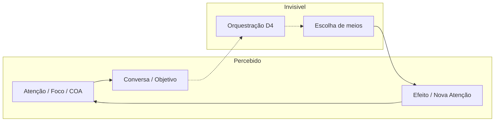

# F2-04 — Princípios da Experiência do CEO

> **Status: Homologada — Gate F2-04 APROVADO (CTO, 26/07/2026). Fase F2 CONCLUÍDA.**  
> Pré-condições: F2-01, F2-02 e F2-03 **homologados**.  
> Natureza: **conceitual e normativa** — princípios permanentes, invariantes e critérios de avaliação da experiência percebida.  
> Precedência: subordinado a CON-001, VIS-007, [`principios-de-produto.md`](principios-de-produto.md) (P1–P6) e [`diretrizes-arquiteturais-experiencia.md`](diretrizes-arquiteturais-experiencia.md) (DA-001…003).  
> **Linha de base F2:** ver [`fundacao-conceitual-experiencia.md`](fundacao-conceitual-experiencia.md). Próxima fase: **F3** — [`F3-01-mapa-de-capacidades-ceo.md`](F3-01-mapa-de-capacidades-ceo.md).  
> **Proibições neste registro:** sem wireframes; sem REQ detalhado; sem commit.

---

## As quatro perguntas (ADR-002)

| Pergunta | Resposta |
|----------|----------|
| **O que é?** | O conjunto de princípios permanentes e invariantes que toda experiência do CEO deve preservar, mais o mapa do que permanece invisível ao usuário e os critérios para julgar soluções de UX sem recorrer a wireframes ou tecnologias. |
| **Por que existe?** | Domínios (F2-01), interações (F2-02) e governança (F2-03) definem a estrutura; falta o *contrato percebido* — o que o usuário deve sentir, o que nunca deve ver, e como recusar uma proposta de UX que viole a arquitetura conceitual. |
| **Para quem?** | CTO (homologação e revisões); Engenheiro (avaliação de propostas F2+/F3/F4); Usuário (transparência do padrão de experiência). |
| **Sucesso?** | Toda solução futura de experiência é aprovada ou rejeitada citando PX / IX deste documento — sem depender de mockup para o juízo normativo. |

---

## Relação com normas já vigentes

| Norma | Papel | Este artefato |
|-------|-------|---------------|
| **P1–P6** | Princípios de produto (F0) | Permanece; PX/IX **não substituem** P1–P6 |
| **DA-001…003** | Diretrizes arquiteturais (F1) | Permanece; PX/IX as **operacionalizam na percepção** |
| **F2-01…F2-03** | Arquitetura conceitual | Fonte estrutural; este documento é a **face experiencial** |

**Ordem de conflito:** CON-001 / VIS → P1–P6 → DA-001…003 → **PX / IX (este documento)** → preferências de implementação ou estética.

---

## 1. Princípios permanentes da experiência (PX)

Princípios **permanentes**: valem em qualquer superfície, sessão ou COA. Não são tendências de UI.

### PX-01 — Posto de comando, não aplicativo

A experiência transmite **controle soberano** do usuário (P1). O CEO é o lugar de onde se governa o trabalho — não um app que “resolve sozinho” nem uma sala de chat genérica.

### PX-02 — Objetivo antes de qualquer meio

Toda jornada perceptível começa (ou imediatamente reconduz) ao **objetivo / intenção** (DA-001). A experiência nunca abre pela escolha de ferramenta, provedor ou capacidade interna.

### PX-03 — Um contexto ativo por vez

A experiência reflete **exatamente um COA ativo** (VIS-007). Trocar de contexto é ato explícito; misturar patrimônios ou focos de COAs distintos é falha de experiência.

### PX-04 — A conversa conduz; o restante contextualiza

A **conversa é a interface principal** (VIS-007). Painéis, listas e resumos existem para alimentar atenção e decisão — não para competir com o centro conversacional nem para virar formulário.

### PX-05 — Atenção antes do inventário

O primeiro contato perceptível privilegia **o que exige atenção agora** (D1; considera HP-004). Inventários, arquivos e detalhe profundo vêm depois, sob demanda ou navegação de nível (DA-003).

### PX-06 — O ciclo não morre na tarefa

A experiência expressa o **ciclo executivo contínuo** (F2-02): Objetivo→…→Nova Atenção. Concluir tarefa ou fechar sessão **não** apaga o sentido de continuidade do COA (DA-002 / F2-03).

### PX-07 — Clareza de estado governado

O usuário deve perceber, sem investigação, o **estado dos objetivos** que importam (Foco, Ativado, Suspenso relevante) e a identidade do COA — sem confundir isso com andamento técnico de execução (F2-03).

### PX-08 — Honestidade sobre limites

A experiência **não finge** onisciência, conclusão ou autonomia que não possui (CON-001 p.8). Incerteza, gate pendente e “ainda transitório” são estados legítimos e visíveis quando afetam o comando.

### PX-09 — Um objetivo perceptível por superfície

Cada superfície enuncia e cumpre **um objetivo executivo** (P6). Densidade e elegância (P3/P4) servem a esse objetivo — não o contrário.

### PX-10 — Progresso conta o que importa ao comando

A experiência não reduz progresso a percentual de tarefas (tensão HP-005). Privilegia **decisão, efeito e nova atenção** no COA — mesmo enquanto HP-005 permanece em observação como hipótese, o antimodelo “só checklist” já é rejeitado na percepção.

---

## 2. Invariantes que toda interface deverá preservar (IX)

Invariantes são **não negociáveis** na experiência. Violar um IX é defeito de produto, não “escolha de design”.

| ID | Invariante | Teste rápido |
|----|------------|--------------|
| **IX-01** | Sempre há **um COA ativo** identificável na experiência | “Em que contexto estou?” tem resposta imediata |
| **IX-02** | **Foco** (ou ausência explícita de foco) é perceptível | “No que estamos concentrados agora?” |
| **IX-03** | Objetivo/intenção **precede** meios na jornada | Não há tela cujo job seja “escolher a ferramenta” |
| **IX-04** | Patrimônio do COA **sobrevive** a sessão e a tarefa | Reabrir o mesmo COA restaura estado governado relevante |
| **IX-05** | Isolamento entre COAs | Nada do COA B aparece como se fosse do COA A |
| **IX-06** | Controle humano em ações de risco | Surpresa irreversível sem gate é violação (P1) |
| **IX-07** | Orquestração **não** é superfície principal | Não existe “home do orquestrador” para o usuário |
| **IX-08** | Execução **não** substitui Atenção | Andamento bruto não expulsa o quadro situacional |
| **IX-09** | Estado Transitório ≠ Permanente na percepção | O usuário não é levado a tratar rastro efêmero como memória institucional |
| **IX-10** | Navegação de nível **não** troca COA | Subir/descer abstração preserva o mesmo contexto ativo |
| **IX-11** | Conversa permanece centro; apoios são satélites | Remover o centro conversacional esvazia a experiência |
| **IX-12** | Sem domínio experiencial “extra” | Não se inventa uma área de produto fora de D1–D5 + governança já definida |

---

## 3. O que deve permanecer invisível ao usuário

Invisível ≠ inexistente. Existe na arquitetura; **não** se apresenta como objeto de escolha ou de operação cotidiana.

| Camada / ato | Por que invisível | O que o usuário percebe em vez disso |
|--------------|-------------------|--------------------------------------|
| **Escolha de meios** (qual capacidade interna atende) | DA-001; D4 | O CEO encaminha o trabalho; o usuário declara objetivo |
| **Orquestração** (decisão e encaminhamento em D4) | D4 não é interface; D4 não executa | Continuação da conversa / atenção; eventual pedido de autorização (gate) |
| **Composição interna de meios** | Substituibilidade; antimodelos de toolbox | Resultado ou bloqueio compreensível |
| **Plano transitório de encaminhamento** | Estado Transitório (F2-02) | Só o necessário: “em curso”, “precisa da sua autorização”, “concluído / efeito” |
| **Detalhe de execução que não muda o comando** | D5 ≠ D1 | Efeito e Nova Atenção — não telemetria |
| **Rastro bruto pré-promoção** | Permanente só após Atualização em D3 | Honestidade: pendente de consolidação, se afetar decisão |
| **Critérios internos de prioridade não declarados como UI** | Governança (F2-03) serve ao usuário, não o substitui | Sugestão de atenção + autoridade final do usuário |

### Visível com parcimônia (não confundir com “orquestração”)

* Identidade do COA, Foco, objetivos Ativados relevantes.  
* Gates de autorização (P1).  
* Limitações e incertezas (PX-08).  
* Nova Atenção após efeito consolidado.

### Explicitamente não invisível

* Controle e soberania do usuário.  
* Estado governado dos objetivos.  
* Consequências e efeitos que alteram o COA.

---

## 4. Como a arquitetura conceitual se manifesta na experiência percebida

| Arquitetura (fonte) | O usuário **percebe** | O usuário **não** precisa perceber |
|---------------------|----------------------|-----------------------------------|
| **D1** Comando e Atenção | “Isto exige meu foco agora” | Algoritmo de prioridade |
| **D2** Conversa e Intenção | “Estou conduzindo pelo diálogo” | Que a conversa não é o armazém permanente |
| **D3** Contexto e Conhecimento | “Este COA lembra e continua” | Estrutura interna do patrimônio |
| **D4** Orquestração | Quase nada — só gates e desfechos | Que houve decisão/encaminhamento de meios |
| **D5** Execução e Efeito | “Algo foi feito / mudou” (quando importa) | Passo a passo interno da execução |
| **Ciclo contínuo** | O dia (e o COA) **seguem** após uma tarefa | Nome das etapas do ciclo |
| **Transitório / Permanente** | Diferença entre “em andamento” e “fica no COA” | Mecânica de promoção |
| **Ciclo de vida do objetivo** | Criado / em foco / pausado / concluído / cancelado | Diagrama de estados |
| **COA como governança** | Trocar de contexto troca o mundo de trabalho | Que COA ≠ lista de projetos na UI |
| **Foco vs Ativados** | Um privilégio de agora; outros não sumiram | Fila técnica |
| **DA-001…003** | Objetivo primeiro; memória viva; posso subir/descer o zoom sem perder o COA | IDs das diretrizes |

---

## 5. Critérios para avaliar futuras soluções de UX (sem wireframes nem tecnologias)

Usar como **checklist normativo**. Uma proposta de UX (textual, esquemática ou protótipo) **passa** só se não violar os itens aplicáveis.

### 5.1 Critérios de aprovação (deve)

| ID | Critério | Referência |
|----|----------|------------|
| **UXC-01** | Declara qual(is) domínio(s) D1–D5 afeta e qual objetivo de superfície (P6) | F2-01; PX-09 |
| **UXC-02** | Preserva um COA ativo e isolamento | IX-01, IX-05 |
| **UXC-03** | Coloca objetivo/intenção antes de meios | IX-03; DA-001 |
| **UXC-04** | Mantém conversa como centro ou justifica apoio satélite sem deslocá-la | PX-04; IX-11 |
| **UXC-05** | Privilegia atenção/Foco antes de inventário | PX-05; F2-03 |
| **UXC-06** | Respeita continuidade entre sessões e sobrevivência do permanente | IX-04; DA-002 |
| **UXC-07** | Distingue perceptivelmente andamento transitório de memória do COA | IX-09 |
| **UXC-08** | Não atribui ao usuário a escolha de meios/orquestração | §3; IX-07 |
| **UXC-09** | Gates humanos aparecem quando há risco / irreversibilidade | IX-06; P1 |
| **UXC-10** | Navegação de nível não implica troca silenciosa de COA | IX-10; DA-003 |
| **UXC-11** | Fecha o raciocínio em Nova Atenção / estado governado — não em “tarefa ✓” isolada | PX-06; PX-10 |
| **UXC-12** | É honesta sobre limites e pendências | PX-08 |

### 5.2 Critérios de rejeição imediata (não deve)

| ID | Se a proposta… | Viola |
|----|-----------------|-------|
| **UXR-01** | Abre por seletor de ferramentas / modelos / “apps” | DA-001; IX-03 |
| **UXR-02** | Mistura informações de dois COAs na mesma superfície operável | IX-05 |
| **UXR-03** | Transforma orquestração em tela principal | IX-07 |
| **UXR-04** | Apaga ou reinicia o COA ao “completar tarefa” ou ao fim da sessão | DA-002; IX-04 |
| **UXR-05** | Apresenta telemetria de execução como posto de comando | IX-08; PX-01 |
| **UXR-06** | Obriga o usuário a gerenciar handoffs internos de meios | §3 |
| **UXR-07** | Trata chat genérico sem COA / sem objetivo como experiência-alvo | RC-03; PX-03 |
| **UXR-08** | Exige wireframe ou stack para “provar” conformidade normativa | Este §5 — o juízo é conceitual |

### 5.3 Método de avaliação (sem artefato visual)

1. **Narrar** a jornada em uma frase por passo (objetivo → … → nova atenção).  
2. **Marcar** o que seria visível vs invisível (§3).  
3. **Aplicar** UXC-01…12 e UXR-01…08.  
4. **Citar** PX/IX/DA/P violados ou preservados.  
5. **Decidir**: aceitar / aceitar com restrições / rejeitar — **antes** de qualquer wireframe.

Wireframes, quando existirem em fase futura, **ilustram** conformidade; **não a criam**.

---

## 6. Síntese normativa rápida

| O usuário deve sentir | O sistema deve esconder |
|-----------------------|-------------------------|
| Controle, COA, Foco, objetivo | Escolha e composição de meios |
| Continuidade do patrimônio | Rastro transitório como se fosse lei |
| Atenção e decisão | Inventário como tela inicial |
| Honestidade de limites | Falsa autonomia |

---

## 7. Fora de escopo

* Wireframes, mockups, tokens, componentes.  
* Requisitos (REQ), ADRs, arquitetura técnica, APIs.  
* Tecnologias, modelos de IA, agentes nomeados.  
* Substituição de P1–P6 ou das DA.  
* Promoção de HP-004/005/006.  
* Novos domínios.

---

## 8. Deliberação do CTO (Gate F2-04 — homologado) + Encerramento da F2

| Item | Registro |
|------|----------|
| PX-01…PX-10 | ✅ Homologados |
| IX-01…IX-12 | ✅ Homologados |
| Perímetro do invisível / mapa percepção / UXC·UXR | ✅ Homologados |
| **Fase F2** | ✅ **CONCLUÍDA** — Fundação Conceitual consolidada |
| Próxima fase | **F3** — primeira capacidade **F3-01** (Mapa de Capacidades) |

---

## Memória Organizacional

| Campo | Registro |
|-------|----------|
| Quem | Engenheiro (Cursor); CTO (Gate F2-04 + encerramento F2) |
| Quando | 26/07/2026 |
| Por quê | Homologar Princípios da Experiência; encerrar F2; abrir F3-01 |
| Baseado em quê | P1–P6; DA; F2-01…F2-03; deliberação CTO |
| Resultado | F2 concluída; F3-01 submetido; sem commit |
