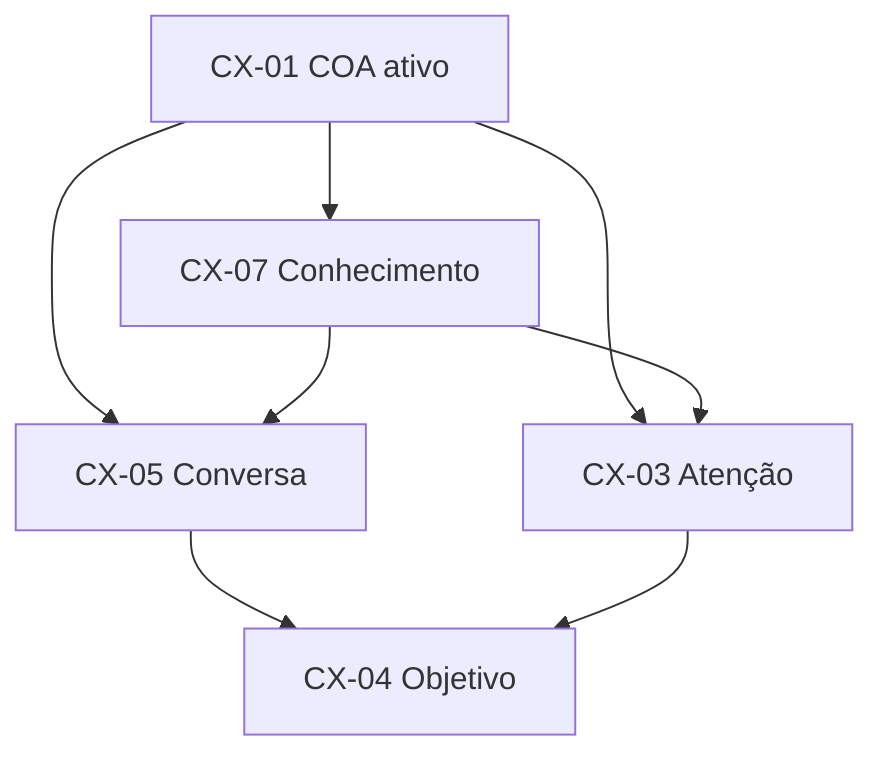
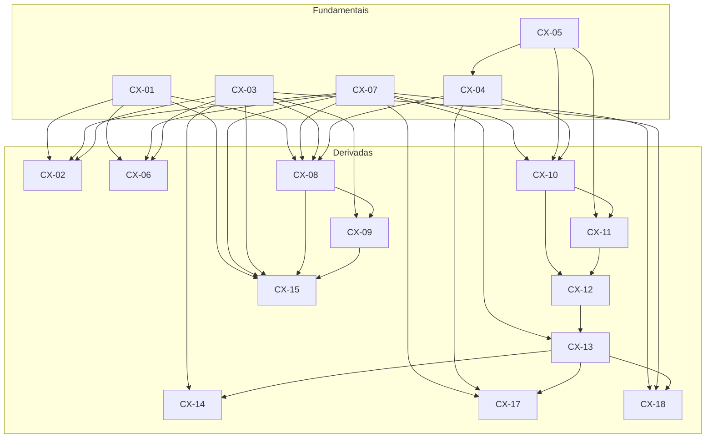
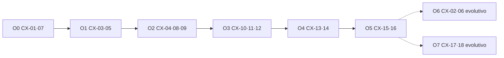

# F3-02 — Modelo de Dependências entre Capacidades do CEO

> **Status: Homologada — Gate F3-02 APROVADO (CTO, 26/07/2026).**  
> Pré-condição: Gate F3-01 **homologado** — inventário CX-01…CX-18 oficial.  
> Natureza: **modelo funcional de dependências e precedência** — homologado (MVP arquitetural + evolutivas + O0–O7).  
> Próxima capacidade: **F3-03** — Modelo Canônico de Especificação de Capacidades.  
> **Proibições neste registro:** sem REQ detalhado; sem ARQ técnica; sem wireframes; sem commit.

---

## As quatro perguntas (ADR-002)

| Pergunta | Resposta |
|----------|----------|
| **O que é?** | O modelo que classifica as CX em fundamentais, derivadas e transversais; declara o **MVP arquitetural**; distingue o evolutivo; e fixa **precedências** (o que deve existir antes do quê). |
| **Por que existe?** | O mapa F3-01 lista capacidades; sem dependências, a priorização futura pode implementar o topo do ciclo (execução) sem a base (COA/atenção) — ou tratar o transversal como opcional. |
| **Para quem?** | CTO (homologação e ondas); Engenheiro (ordem de materialização futura); Usuário (transparência do mínimo viável *arquitetural*). |
| **Sucesso?** | Nenhuma onda futura de REQ/experiência viola a precedência deste modelo; o MVP arquitetural permanece citável e estável. |

---

## Vocabulário

| Termo | Significado |
|-------|-------------|
| **Depende de** | A capacidade **B** só realiza seu propósito se **A** já existir na experiência (A precede B). |
| **Fundamental** | Base da arquitetura funcional: sem ela, o posto de comando e o COA não se sustentam. |
| **Derivada** | Constrói-se sobre fundamentais (e eventualmente outras derivadas); não substitui a base. |
| **Transversal** | Atravessa várias CX; não é “etapa do ciclo”, mas condição de qualidade/governança em múltiplos pontos. |
| **MVP arquitetural** | Conjunto **mínimo** de CX cuja presença conjunta realiza a Fundação Conceitual *em esqueleto operacional* — ainda sem riqueza evolutiva. |
| **Evolutiva / opcional (neste horizonte)** | Amplia fidelidade à visão completa; pode aguardar após o MVP arquitetural **sem** quebrar invariantes IX se o mínimo estiver íntegro. |

**Tipos de dependência (conceituais):**

| Tipo | Símbolo | Significado |
|------|---------|-------------|
| **Estrutural** | → | Sem A, B não tem sentido (ex.: Atenção sem COA) |
| **De ciclo** | ⇒ | B é a etapa seguinte do ciclo contínuo após A |
| **De governança** | ⇢ | B governa ou ordena objetos que A torna existentes |
| **Transversal** | ↔ | A condiciona a qualidade de B em vários pontos (não é pré-requisito único de construção) |

---

## 1. Capacidades fundamentais (base da arquitetura funcional)

Sem estas, não há CEO como posto de comando com COA — apenas fragmentos.

| ID | Capacidade | Por que é fundamental |
|----|------------|------------------------|
| **CX-01** | Estabelecer e exibir o COA ativo | Lente única; IX-01 |
| **CX-03** | Apresentar o quadro de Atenção | D1 — posto de comando perceptível |
| **CX-04** | Declarar e conduzir Objetivo / Intenção | DA-001 — norte antes de meios |
| **CX-05** | Conversar como interface principal | VIS-007 / PX-04 — centro da experiência |
| **CX-07** | Consultar e ancorar Contexto / Conhecimento | D3 — âncora do permanente |

**Núcleo fundamental mínimo de coexistência:** CX-01 + CX-03 + CX-04 + CX-05 + CX-07.

---

## 2. Capacidades derivadas e suas dependências

Derivadas **presupõem** o núcleo fundamental (e, quando indicado, outras derivadas).

| ID | Capacidade | Depende de (estrutural / ciclo / governança) | Tipo |
|----|------------|-----------------------------------------------|------|
| **CX-02** | Trocar COA com isolamento | **CX-01** (estrutural); **CX-07** (patrimônio a isolar); **CX-03** (restaurar quadro destino) | Derivada |
| **CX-06** | Navegar níveis de abstração | **CX-01**, **CX-07**; **CX-03** (atenção no nível) | Derivada |
| **CX-08** | Governar ciclo de vida de Objetivos | **CX-01**, **CX-04**; **CX-07** (permanente); **CX-03** (espelho) | Derivada |
| **CX-09** | Prioridade e Foco | **CX-08** (objetivos Ativados); **CX-03** (refletir Foco); **CX-01** | Derivada |
| **CX-10** | Solicitar meios (orquestração invisível) | **CX-04** (intenção); **CX-07** (recorte); **CX-05** (canal) | Derivada de ciclo |
| **CX-11** | Gates de autorização | **CX-10** (há encaminhamento a autorizar); **CX-05** / **CX-03** (superfície do gate) | Derivada |
| **CX-12** | Acompanhar Execução e Efeito | **CX-10** (houve encaminhamento); tipicamente após **CX-11** quando gate exigido | Derivada de ciclo |
| **CX-13** | Aprender e promover ao Permanente | **CX-12** (efeito); **CX-07** (destino permanente); **CX-01** | Derivada de ciclo |
| **CX-14** | Renovar Nova Atenção | **CX-13** (atualização); **CX-03** (quadro) | Derivada de ciclo |
| **CX-15** | Continuidade entre sessões | **CX-01**, **CX-07**; **CX-08** / **CX-09** (estado governado a restaurar); **CX-03** | Derivada |
| **CX-17** | Registrar decisão e justificativa | **CX-04**, **CX-07**; reforça **CX-13** | Derivada |
| **CX-18** | Progresso de comando vs checklist | **CX-03**, **CX-07**; beneficia-se de **CX-13** / **CX-14** | Derivada |

### 2.1 Grafo de dependências (visão consolidada)

**Nota:** CX-11 → CX-12 é dependência **condicional** (quando O-03 exige gate). Sem gate, CX-12 depende de CX-10 diretamente.

---

## 3. Capacidades transversais

Não formam um degrau único do ciclo; **condicionam** várias CX.

| ID | Capacidade | Atravessa | Papel transversal |
|----|------------|-----------|-------------------|
| **CX-16** | Explicitar limites e estados transitórios | CX-04, CX-05, CX-10…CX-14, CX-11 | Honestidade (PX-08 / IX-09) em qualquer ponto com incerteza ou pré-promoção |
| **CX-01** | COA ativo *(também fundamental)* | Todas | Toda CX operável herda a lente; listada aqui pelo caráter onipresente |
| **CX-15** | Continuidade entre sessões *(também derivada)* | CX-03, CX-08, CX-09, CX-07 | Garante DA-002 no tempo; não é etapa do ciclo diário |

### Regras transversais

1. **CX-16** não “vem depois” do MVP no sentido de ser descartável: no MVP arquitetural ela é **obrigatória em forma mínima** (ver §4) — ao menos para gates, pendência de consolidação e “não posso”.  
2. Transversais **não substituem** fundamentais: CX-16 sem CX-01 é mensagem sem contexto.  
3. Nenhuma transversal autoriza tornar orquestração (D4) em superfície.

---

## 4. Capacidades obrigatórias para um MVP arquitetural

**MVP arquitetural** = menor conjunto de CX que realiza, em esqueleto, a Fundação Conceitual: um COA, atenção, conversa com objetivo, conhecimento âncora, um ciclo completo Objetivo→…→Nova Atenção com meios invisíveis, e continuidade mínima — **sem** exigir multi-COA rico, zoom fino de níveis, nem sofisticação de progresso/decisão.

### 4.1 Conjunto obrigatório (MVP-A)

| ID | No MVP-A porque |
|----|-----------------|
| **CX-01** | Sem COA não há produto (IX-01) |
| **CX-03** | Sem Atenção não há posto de comando |
| **CX-04** | Sem Objetivo viola DA-001 |
| **CX-05** | Sem conversa viola VIS-007 |
| **CX-07** | Sem âncora de conhecimento o ciclo não fecha em permanente |
| **CX-08** | Sem ciclo de vida de objetivo a governança F2-03 não existe (forma mínima: criar/ativar/concluir ou cancelar) |
| **CX-09** | Forma mínima: ao menos **um Foco** explícito (mesmo com um único Ativado) |
| **CX-10** | Sem pedido de meios o ciclo para na intenção (D4 permanece invisível) |
| **CX-11** | Forma mínima: capacidade de gate quando houver risco (P1 / IX-06) — pode ser raramente acionada, mas **deve existir** |
| **CX-12** | Sem efeito perceptível o ciclo não tem Execução |
| **CX-13** | Sem promoção DA-002 falha |
| **CX-14** | Sem Nova Atenção o ciclo contínuo não fecha |
| **CX-15** | Forma mínima: reabrir o mesmo COA restaura permanente essencial |
| **CX-16** | Forma mínima: limites + transitório vs permanente perceptíveis nos pontos críticos |

**Contagem MVP-A:** 14 capacidades (CX-01, 03–05, 07–16).

### 4.2 Explicitamente fora do MVP-A (ver §5)

CX-02, CX-06, CX-17, CX-18 — **não** entram no mínimo arquitetural, desde que as invariantes do MVP-A sejam respeitadas (um COA basta; nível único inicial; decisão formal e progresso sofisticado podem evoluir).

### 4.3 Integridade do MVP-A

O MVP-A é **inválido** se:

* omitir qualquer CX da tabela §4.1;  
* implementar CX-10…12 **sem** CX-01/04/07;  
* omitir CX-13/14 (ciclo truncado em “execução ok”);  
* omitir CX-15 (sessão = memória);  
* expor escolha de meios sob o rótulo de CX-10.

---

## 5. Capacidades opcionais ou evolutivas

Podem aguardar ondas posteriores ao MVP-A **sem** negar a Fundação — com ressalvas.

| ID | Capacidade | Classificação | Condição para adiar | Risco se adiar demais |
|----|------------|---------------|---------------------|------------------------|
| **CX-02** | Trocar COA | **Evolutiva** | MVP com **um** COA operacional | Uso diário multi-contexto (VIS-007 pleno) fica limitado |
| **CX-06** | Níveis de abstração | **Evolutiva** | Um nível situacional inicial | DA-003 só parcialmente vivida |
| **CX-17** | Decisão + justificativa | **Evolutiva / reforço** | Decisões ainda cabem em CX-13/04 de forma simples | HP-006 permanece só observação; rastreio fraco |
| **CX-18** | Progresso ≠ checklist | **Evolutiva / reforço** | Atenção (CX-03) + efeitos (CX-12…14) já evitam o pior antimodelo | Regressão a dashboard de % |

**Não são “opcionais de produto final”:** são opcionais *em relação ao MVP arquitetural*. A visão completa do CEO **inclui** CX-02 e CX-06; CX-17/18 fortalecem identidade e HP em observação.

---

## 6. Relações de precedência entre capacidades

### 6.1 Ordens de precedência (ondas conceituais)

Não são sprints — são **camadas de existência** na experiência.

| Ordem | Capacidades | Nome da camada |
|-------|-------------|----------------|
| **O0** | CX-01, CX-07 | Lente e patrimônio |
| **O1** | CX-03, CX-05 | Posto e conversa |
| **O2** | CX-04, CX-08, CX-09 | Objetivo e governança mínima |
| **O3** | CX-10, CX-11, CX-12 | Meios invisíveis, gate, efeito |
| **O4** | CX-13, CX-14 | Aprendizado, permanente, nova atenção |
| **O5** | CX-15, CX-16 | Continuidade e honestidade (mínimo desde O0–O4 nos pontos de contato) |
| **O6** | CX-02, CX-06 | Multi-COA e níveis (evolutivo) |
| **O7** | CX-17, CX-18 | Decisão formal e progresso de comando (evolutivo) |

**Leitura:** O5 (CX-15/16) *amarra* O0–O4; na prática CX-16 aparece cedo (transversal), mas a *precedência de completude* do MVP-A exige O0→O4 + CX-15/16 íntegras.

### 6.2 Precedências críticas (não violar)

| Precedência | Regra |
|-------------|-------|
| CX-01 ≺ quase tudo | Nenhuma CX operável sem COA ativo |
| CX-07 ≺ CX-03, CX-10, CX-13 | Atenção, meios e promoção precisam de âncora |
| CX-04 ≺ CX-10 | Intenção antes de meios |
| CX-08 ≺ CX-09 | Sem objetos de vida, não há Foco/prioridade |
| CX-10 ≺ CX-12 | Sem encaminhamento, não há execução a acompanhar |
| CX-11 ≺ CX-12 *(se gate)* | Risco exige autorização antes do efeito |
| CX-12 ≺ CX-13 ≺ CX-14 | Ciclo contínuo |
| CX-01+CX-07+CX-08+CX-09 ≺ CX-15 | Continuidade restaura estado governado |
| CX-01 ≺ CX-02 | Troca pressupõe COA estabelecido |
| CX-01+CX-07 ≺ CX-06 | Níveis dentro do mesmo COA |
| Fundamentais ≺ Evolutivas (O6–O7) | Não construir multi-COA/níveis/decisão rica sobre base oca |

### 6.3 Diagrama de precedência do ciclo (MVP-A)

### 6.4 Anti-precedências (proibidas)

| Proibido | Motivo |
|----------|--------|
| CX-12 antes de CX-04/CX-10 | Execução sem objetivo/encaminhamento |
| CX-13 sem CX-07 | “Memória” sem domínio de conhecimento |
| CX-02 sem CX-01 e isolamento via CX-07 | Multi-contexto sem lente |
| CX-09 sem CX-08 | Foco sem ciclo de vida |
| Qualquer CX de “escolher meio” | Viola DA-001 / invisível |
| Tratar CX-16 como cosmética pós-MVP | Viola PX-08 / IX-09 no esqueleto |

---

## 7. Síntese classificatória

| Classe | IDs |
|--------|-----|
| **Fundamentais** | CX-01, CX-03, CX-04, CX-05, CX-07 |
| **Derivadas (MVP-A)** | CX-08, CX-09, CX-10, CX-11, CX-12, CX-13, CX-14, CX-15 |
| **Transversal (MVP-A mínimo)** | CX-16 *(+ CX-01 como lente onipresente)* |
| **Evolutivas** | CX-02, CX-06, CX-17, CX-18 |
| **MVP arquitetural** | CX-01, 03–05, 07–16 |
| **Pós-MVP arquitetural** | CX-02, 06, 17, 18 |

---

## 8. Fora de escopo

* Requisitos detalhados, critérios de aceite de software.  
* Arquitetura técnica, componentes, APIs, dados.  
* Wireframes, estimativas, sprints.  
* Novas CX além de CX-01…18 (salvo deliberação que reabra F3-01).  
* Fusão com CAP-001.

---

## 9. Deliberação do CTO (Gate F3-02 — homologado)

| Item | Registro |
|------|----------|
| Classificação fundamental / derivada / transversal | ✅ Homologada |
| MVP arquitetural (CX-01, 03–05, 07–16) | ✅ Homologado |
| Evolutivas (CX-02, 06, 17, 18) | ✅ Homologadas |
| Precedências O0–O7 e anti-precedências | ✅ Homologadas |
| Próxima capacidade | **F3-03** — Modelo Canônico de Especificação de Capacidades |

---

## Memória Organizacional

| Campo | Registro |
|-------|----------|
| Quem | Engenheiro (Cursor); CTO (Gate F3-02 homologado) |
| Quando | 26/07/2026 |
| Por quê | Gate F3-02 — Modelo de Dependências |
| Baseado em quê | F3-01; Fundação Conceitual; deliberação CTO |
| Resultado | Homologada; F3-03 aberta; sem commit |
